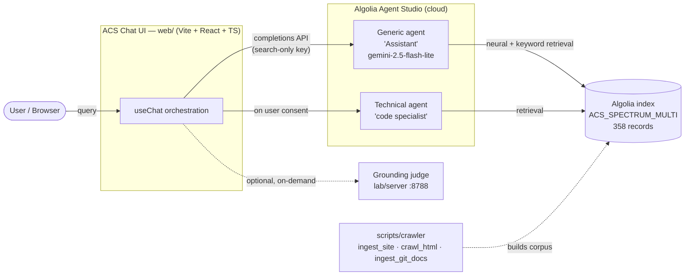
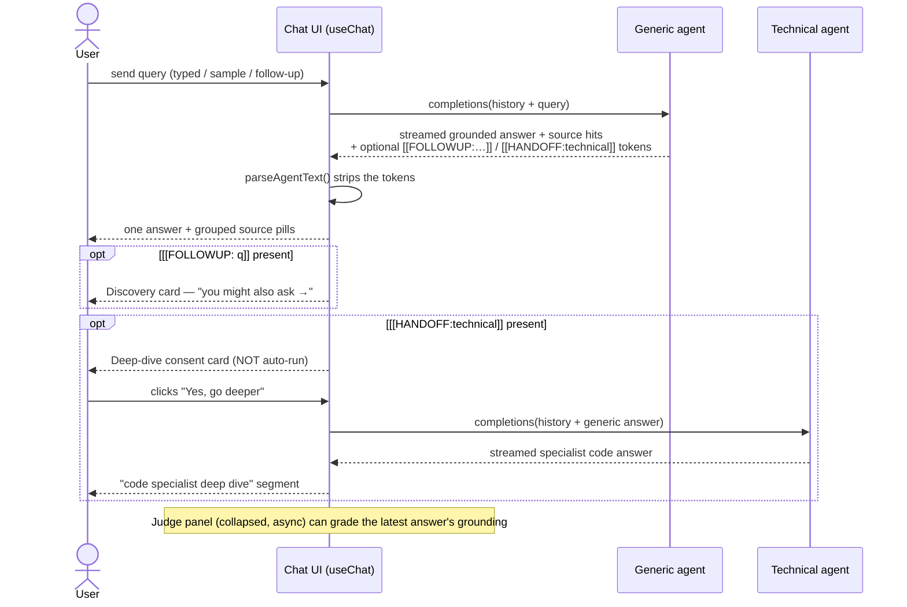

# Algolia Central — Spectrum (ACS)

A **strictly-grounded RAG chat app**: ask anything about the Adobe Spectrum design system and React Spectrum, and get an answer that is **retrieved from the real docs and cites its sources** — never invented. Built as an Algolia × Adobe co-branded demo of Algolia [Agent Studio](https://www.algolia.com/) sitting on top of an Algolia index.

It is one concrete instance of a reusable **`Algolia-Central-[Company]`** pattern: a client-branded search-answer screen where every answer is grounded in that client's own corpus.

> **Live demo:** deployed on Vercel (see [Deployment](#deployment)). **App runs locally at `http://localhost:5173`.**

---

## What it does

- **One grounded answer per question**, streamed live, with **source pills** citing the exact Spectrum docs used.
- **Human-gated deep dive** — for code-heavy questions the assistant *offers* to bring in a "code specialist"; the specialist only runs when the user clicks **Yes**. No noisy auto-relay.
- **Discovery follow-ups** — the assistant suggests a real next question you might ask (agent-generated, not canned).
- **On-demand grounding judge** — a separate service can grade any answer for grounding/coverage/depth (collapsed by default; the app works without it).
- **Refuses when it can't ground** — if the corpus doesn't cover it, the assistant says so instead of hallucinating.

---

## Architecture

The browser talks **directly** to Algolia Agent Studio (using a search-only key). Agent Studio does the retrieval against the Algolia index and runs the LLM. The judge is an optional local service.



### A single turn (the app's core loop)



**Token protocol** (machine-readable signals the Generic agent appends to its own text; the UI strips them before display — see `web/src/hooks/useChat.ts` + `web/src/lib/agents.ts`):

| Token | Emitted when | UI effect |
|---|---|---|
| `[[HANDOFF:technical]]` | question needs deep code handling | shows the deep-dive **consent** card; specialist runs only on click |
| `[[FOLLOWUP: <question>]]` | a natural next question exists | shows the **discovery** card with that question |

---

## Quickstart

**Prerequisites:** Node 18+ (Vite 7). An Algolia app with the `ACS_SPECTRUM_MULTI` index and the two Agent Studio agents already provisioned (IDs live in `web/src/config/instances/spectrum.ts`).

```bash
# 1. Configure the frontend env (browser-safe, search-only key)
cd web
cp .env.local.example .env.local
#   then edit .env.local and fill in:
#     VITE_ALGOLIA_APP_ID=...
#     VITE_ALGOLIA_SEARCH_API_KEY=...   # SEARCH-ONLY key, never the admin key

# 2. Run the app
npm install
npm run dev            # → http://localhost:5173

# 3. (Optional) run the grounding judge in a second terminal
cd ../lab/server
npm install
npm run judge:serve    # → http://localhost:8788
```

> Hard-refresh the browser (**Cmd/Ctrl+Shift+R**) after edits — Vite HMR + Agent Studio response caching can otherwise show stale views.

### Environment variables

| Var | Where | Required | Purpose |
|---|---|---|---|
| `VITE_ALGOLIA_APP_ID` | `web/.env.local` (build-time) | ✅ | Algolia app hosting the index + agents |
| `VITE_ALGOLIA_SEARCH_API_KEY` | `web/.env.local` (build-time) | ✅ | **Search-only** key — inlined into the browser bundle |
| `VITE_JUDGE_URL` | `web/.env.local` | ⬜ | Judge base URL; defaults to `http://localhost:8788` |

The `web/` env vars are inlined at build time, so they must be **browser-safe**. The app validates both at startup and renders a clear "Configuration error" screen (not a blank page) if either is missing.

---

## Project layout

```
Algolia-Central-Spectrum/
├── vercel.json              # Vercel: build web/ → web/dist (fixes root-build 404)
├── web/                     # the chat app (Vite + React + TypeScript + Tailwind)
│   ├── src/
│   │   ├── App.tsx          # shell: chat column + right judge panel
│   │   ├── components/      # presentational UI (see docs/ARCHITECTURE.md)
│   │   ├── hooks/           # useChat (turn orchestration), useJudge
│   │   ├── lib/             # agentStudio (API client), agents, sources, judgeClient
│   │   ├── config/          # InstanceConfig contract + the `spectrum` instance
│   │   ├── themes/          # Algolia × Adobe skin (Sora, Nebula Blue tokens)
│   │   └── styles/          # design tokens
│   └── .env.local.example
├── lab/                     # the grounding-judge stack (separate from the app)
│   ├── judge/               # provider-agnostic judge library (rubric, gate, synthesis)
│   ├── server/              # HTTP wrapper — POST /api/judge on :8788
│   └── eval/                # offline eval harness (batch scoring)
├── scripts/                 # corpus + agent tooling (not shipped to the browser)
│   ├── crawler/             # ingest_site · crawl_html · ingest_git_docs · provision
│   ├── agents/              # build/update Agent Studio agents + their instructions
│   └── neural/              # enable neural (semantic) search on the index
└── docs/                    # architecture notes + diagrams
```

Full dir-by-dir breakdown: **[docs/ARCHITECTURE.md](docs/ARCHITECTURE.md)**. Editable diagram sources (Excalidraw): **[docs/diagrams/](docs/diagrams/)**.

---

## The corpus

`ACS_SPECTRUM_MULTI` — **358 records** across three sources (facet `source`), all built by `scripts/crawler`:

| Source facet | Records | What | Tool |
|---|---:|---|---|
| `SpectrumDesignDocs` | 103 | GitHub `adobe/spectrum-design-data` S2 design guidance | `ingest_git_docs.mjs` |
| `ReactSpectrumS2` | 111 | `react-spectrum.adobe.com` S2 code/API (`.md` twins) | `ingest_site.mjs` |
| `ReactSpectrumV3` | 144 | `react-spectrum.adobe.com/v3/*` (server-rendered HTML) | `crawl_html.mjs` |

> **Why three tools:** Algolia's native crawler can't crawl a domain you don't own, so third-party corpora are self-fetched and pushed via the indexing API. Sites with `llms.txt`/`.md` twins use `ingest_site.mjs`; server-rendered HTML uses `crawl_html.mjs`; Git docs use `ingest_git_docs.mjs`.

---

## The grounding judge (`lab/`)

An optional, provider-agnostic service that grades an answer against its cited sources on four dimensions (Grounding / Coverage / Depth / Relevance) with a **grounding hard-gate** — an answer that makes unsupported claims fails regardless of how good it reads. The app calls it on demand (`web/src/lib/judgeClient.ts` → `POST /api/judge`); the panel is collapsed by default and the app is fully functional without it.

---

## Deployment

The app is a static Vite build. `vercel.json` (repo root) tells Vercel to build the `web/` sub-directory:

```jsonc
{
  "installCommand": "cd web && npm install",
  "buildCommand":   "cd web && npm run build",
  "outputDirectory": "web/dist"
}
```

**After connecting the repo to Vercel you MUST set two Environment Variables** in the Vercel project settings (Production + Preview), or the deployed app will render the "Configuration error" screen:

- `VITE_ALGOLIA_APP_ID`
- `VITE_ALGOLIA_SEARCH_API_KEY` (search-only — safe to expose)

The grounding judge (`lab/server`) is **not** part of the static deploy; leave `VITE_JUDGE_URL` unset in production (the judge panel simply stays inactive).

---

## License / status

Internal Algolia sales-engineering demo. Not for public redistribution of the underlying Adobe Spectrum content.
