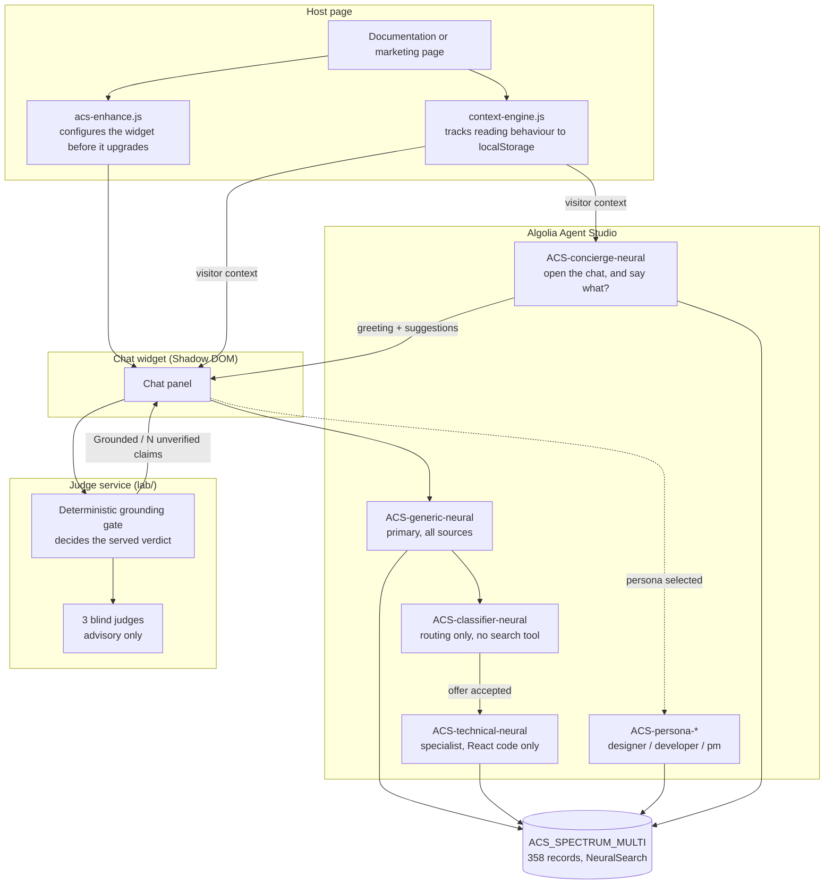

# Algolia Central — Adobe Spectrum

A conversational assistant over the Adobe Spectrum design system. It answers **only** from indexed Spectrum documentation and React Spectrum source, cites the records it used, and attaches a reproducible grounding verdict to every answer.

Two things make it different from a chat box over a search index:

1. **Nothing is answered from model memory.** If the corpus does not contain it, the assistant says so rather than guessing. The grounding check that enforces this is deterministic — the same answer produces the same verdict every time.
2. **It reacts to what the visitor is reading.** On the documentation surface, the page tracks which pages are read and hands that context to the agent, so the assistant can open a conversation with something specific rather than a generic greeting.

---

## Live surfaces

| URL | What it is |
|---|---|
| `/` | Marketing page for the assistant, with the widget embedded |
| `/demo/` | A simulated Adobe Spectrum documentation site (five pages) — the surface where proactive context is demonstrated |
| `/app` | The same assistant as a full-screen React application, independent rendering path |

The grounding judge runs as a separate HTTP service, not on Vercel. See [Deployment](#deployment).

---

## Algolia services this depends on

| Service | Used for |
|---|---|
| **Algolia Search** | The `ACS_SPECTRUM_MULTI` index — the only source of truth for answers |
| **NeuralSearch** | Enabled on that index; retrieval is semantic, not keyword-only |
| **Agent Studio** | Hosts every agent (answering, routing, persona, judge) and streams completions |
| **Algolia Inference** | The model provider behind the agents |

---

## The corpus

`ACS_SPECTRUM_MULTI` — **358 records** across **three sources** (facet `source`), NeuralSearch enabled. Built by the scripts in `scripts/crawler/`.

| Source facet | Records | Content | Ingest tool |
|---|---|---|---|
| `ReactSpectrumV3` | 144 | `react-spectrum.adobe.com/v3/*`, server-rendered HTML | `crawl_html.mjs` |
| `ReactSpectrumS2` | 111 | `react-spectrum.adobe.com` S2 code and API docs (`.md` twins) | `ingest_site.mjs` |
| `SpectrumDesignDocs` | 103 | `adobe/spectrum-design-data` S2 design guidance | `ingest_git_docs.mjs` |

**Why three ingest tools:** Algolia's managed crawler cannot crawl a domain you do not own, so these corpora are self-fetched and pushed through the indexing API. Sites publishing `llms.txt` / `.md` twins use `ingest_site.mjs`; server-rendered HTML uses `crawl_html.mjs`; Git-hosted docs use `ingest_git_docs.mjs`.

---

## Architecture


```mermaid
flowchart TB
  subgraph host["Host page"]
    PAGE["Documentation or marketing page"]
    ENH["acs-enhance.js<br/>configures the widget before it upgrades"]
    CTX["context-engine.js<br/>tracks reading behaviour to localStorage"]
  end

  subgraph widget["Chat widget (Shadow DOM)"]
    UI["Chat panel"]
  end

  subgraph studio["Algolia Agent Studio"]
    CONC["ACS-concierge-neural<br/>open the chat, and say what?"]
    GEN["ACS-generic-neural<br/>primary, all sources"]
    TECH["ACS-technical-neural<br/>specialist, React code only"]
    PERS["ACS-persona-*<br/>designer / developer / pm"]
    CLS["ACS-classifier-neural<br/>routing only, no search tool"]
  end

  IDX[("ACS_SPECTRUM_MULTI<br/>358 records, NeuralSearch")]

  subgraph judge["Judge service (lab/)"]
    DET["Deterministic grounding gate<br/>decides the served verdict"]
    PANEL["3 blind judges<br/>advisory only"]
  end

  PAGE --> CTX
  PAGE --> ENH
  ENH --> UI
  CTX -->|visitor context| CONC
  CONC -->|greeting + suggestions| UI
  CTX -->|visitor context| UI
  UI --> GEN
  UI -.persona selected.-> PERS
  GEN --> IDX
  TECH --> IDX
  PERS --> IDX
  CONC --> IDX
  GEN --> CLS
  CLS -->|offer accepted| TECH
  UI --> DET
  DET --> PANEL
  DET -->|Grounded / N unverified claims| UI
```

### A single turn

1. The visitor asks a question. If the host page registered a context provider, the question is sent with a **visitor-context block** describing who they are and what they have been reading.
2. The **primary agent** — or the selected **persona agent** — searches the index and streams an answer with its sources.
3. The **classifier** then sees the question, the answer, the retrieved records **and the same visitor context**, and decides whether a specialist deep-dive is worth offering.
4. If it offers one and the visitor accepts, the **technical specialist** answers, scoped to the React code sources.
5. The answer goes to the judge service, which returns a grounding verdict rendered as a chip.

The deep-dive is never automatic — the specialist runs only on explicit consent.

### Proactive context (the `/demo/` surface)

`context-engine.js` runs on each documentation page and records behaviour in `localStorage`:

| Signal | Trigger |
|---|---|
| `page_view` | Page load |
| `page_read` | 30 seconds of dwell, or 60% scroll depth |
| `cta_click` | Click on any element carrying `data-cta` |
| Per-page dwell | Flushed on `visibilitychange` and `beforeunload` |

Storage keys: `acs_profile` (persona, first seen, visit count), `acs_session` (pages and dwell, 30-minute TTL), `acs_events` (capped at 50; the most recent 20 travel with a request), `acs_pending_greeting` (10-minute TTL).

On each page load the engine sends that context to the **concierge agent**, which returns a decision: engage or stay silent, plus a greeting and suggested questions. When it engages, the chat opens itself with a greeting referencing what was actually read. If the visitor navigates away before the call returns, the greeting is cached and shown on the next page rather than lost.

A persona selector (`auto`, `designer`, `developer`, `pm`) switches which agent answers, at runtime, without remounting the widget.

**The widget never reads host storage itself.** The host registers a provider function, because deciding what a visitor has consented to share belongs to the host, not the library.

---

## The agents

All agents live on Algolia app `0EXRPAXB56` in Agent Studio. Every one runs the **`medium`** model on Algolia Inference.

### Answering and routing

| Agent | ID | Role | Source filter |
|---|---|---|---|
| `ACS-generic-neural` | `95826da6-d1b6-4b81-b061-bfb52b881356` | Primary — answers everything, synthesises design and code | none |
| `ACS-technical-neural` | `ae127977-c728-4b7c-bc15-6502a77873d1` | Specialist — deep-dive on explicit consent only | `source:"ReactSpectrumS2" OR source:"ReactSpectrumV3"` |
| `ACS-classifier-neural` | `dbb4faa9-e917-4be9-b8ee-6dfd9a81daef` | Decides the deep-dive offer. Internal, never shown, no search tool | n/a |

### Proactive

| Agent | ID | Role | Source filter |
|---|---|---|---|
| `ACS-concierge-neural` | `213315ed-0488-4329-8fc6-db4691148a09` | Decides whether to open the chat, and writes the greeting | none |
| `ACS-persona-designer` | `6b716c73-0072-4ce7-b915-c4dc00f8b74d` | Answers in a design-focused voice | `source:SpectrumDesignDocs` |
| `ACS-persona-developer` | `06c4f43e-a16c-4783-b061-539e063397a4` | Answers in an implementation-focused voice | `source:ReactSpectrumS2 OR source:ReactSpectrumV3` |
| `ACS-persona-pm` | `17cb7a0a-5e04-41ec-9527-e914f648c995` | Answers in an adoption and migration voice | none |

### Judge panel

| Agent | ID | Role |
|---|---|---|
| `ACS-judge-skeptic` | `0eba9eb4-dd20-42a4-8ae3-41cb84b54a79` | Scores the rubric under a skeptical lens |
| `ACS-judge-referee` | `b0f03391-3433-42ea-bc50-183ba990e697` | Neutral arbiter |
| `ACS-judge-advocate` | `b084b478-bd3a-41a7-9a29-818ae0fb9706` | Steelmans the answer |

The judges are rubric-agnostic scoring backends: the rubric travels with each request from `lab/judge`, so revising it never requires republishing an agent.

---

## The grounding judge (`lab/`)

Two independent checks, and only one of them decides what the visitor sees.

**The deterministic gate decides the served verdict.** It is a rule-based verbatim check over term classes that cannot legitimately be paraphrased — code identifiers, scaled numbers, CamelCase API names. Prose is deliberately excluded: "a size smaller" versus "one size smaller" is legitimate rewording, and a verbatim rule over prose false-positives constantly. The gate costs zero tokens and returns the same verdict for the same input every time.

**The LLM panel is advisory.** Three blind judges score the rubric independently, none seeing another's output. Their findings annotate the verdict; they never override the gate.

The rubric is **"Algolia answer quality v4"** — a single `usefulness` dimension, with grounding handled by the gate rather than scored as a number. A flagged claim counts only when **at least two of the three judges** independently agree, so one judge alone cannot cap an answer.

The visitor-facing chip is **binary** — `Grounded`, or `N unverified claims`. Never a decimal, never a percentage, because a number would imply a precision the check does not claim.

---

## Repository layout

```
├── vendor/algolia-central-chat-widget/   Algolia engineering's chat widget. READ-ONLY.
│   ├── chat-central/                     InstantSearch plumbing + React chat UI
│   ├── algolia-chat/                     the <algolia-chat> web component
│   └── website/                          static site: marketing page + /demo/ pages
│
├── web-widget/                           host-page enhancement layer, builds acs-enhance.js
├── web/                                  full-screen React chat app, served at /app
│
├── lab/
│   ├── judge/                            grounding gate, rubric, corroboration logic
│   └── server/                           the judge HTTP service
│
├── scripts/
│   ├── crawler/                          corpus ingestion (one tool per source shape)
│   ├── agents/                           Agent Studio setup, instructions, snapshots
│   ├── neural/                           enable NeuralSearch on the index
│   ├── widget/build_demo_site.mjs        assembles the deployable site
│   ├── deploy/build_prod_site.sh         the production build (Vercel runs this)
│   └── mint_search_key.mjs               mint a browser-safe search-only key
│
├── deploy/                               judge service: Dockerfile, compose, systemd
└── docs/
    ├── ARCHITECTURE.md                   file-by-file walkthrough
    ├── DEPLOYING.md                      deploy runbook for all three deployables
    └── design/                           design notes for work not yet built
```

`vendor/` is vendored read-only so the diff against upstream stays meaningful. Changes to it go upstream as pull requests, never as local edits — see [`vendor/README.md`](vendor/README.md).

---

## Quickstart

```bash
# 1. Full-screen app (web/)
cp web/.env.local.example web/.env.local
#    then set:
#      VITE_ALGOLIA_APP_ID=0EXRPAXB56
#      VITE_ALGOLIA_SEARCH_API_KEY=...   # SEARCH-ONLY key — never an admin key.
#                                        # Mint one: node scripts/mint_search_key.mjs
npm --prefix web install
npm --prefix web run dev

# 2. Grounding judge, in a second terminal (optional — the chip stays dark without it)
npm --prefix lab/server install
npm --prefix lab/server run judge:serve          # binds :8788

# 3. The widget site (marketing page + /demo/ pages)
npm --prefix vendor/algolia-central-chat-widget/chat-central install
npm --prefix vendor/algolia-central-chat-widget/chat-central run build
npm --prefix vendor/algolia-central-chat-widget/algolia-chat install
npm --prefix vendor/algolia-central-chat-widget/algolia-chat run build
npm --prefix web-widget install
VITE_JUDGE_URL=http://localhost:8788 npm --prefix web-widget run build
node scripts/widget/build_demo_site.mjs --out dist-widget
#    then serve dist-widget/ with any static file server
```

### Environment variables

| Variable | Used by | Notes |
|---|---|---|
| `ALGOLIA_APP_ID` | scripts | `0EXRPAXB56` |
| `ALGOLIA_ADMIN_API_KEY` | scripts only | **Never** ships to a browser |
| `ALGOLIA_SEARCH_API_KEY` | browser | Search-only. Safe to publish — that is its purpose |
| `VITE_JUDGE_URL` | `web-widget`, `web` | Judge service base URL, baked in at build time |
| `VITE_LAB_API_KEY` | `web-widget`, `web` | Shared secret for the judge service |
| `LAB_API_KEY` | `lab/server` | Judge auth. Unset means the service is open |
| `ALGOLIA_INFERENCE_BASE_URL` | `lab/server` | Model provider endpoint |

### Tests

```bash
npm --prefix lab/judge run test      # 153 tests — gate, rubric, corroboration
npm --prefix lab/server run test     #  65 tests — service, auth, usage, providers
npm --prefix web-widget run test     #   8 tests — host-page configuration
npm --prefix web run test            # client tests
```

---

## Deployment

Three deployables. None deploys automatically; each is a deliberate, manual step. Full runbook: [`docs/DEPLOYING.md`](docs/DEPLOYING.md).

| Deployable | Where | How |
|---|---|---|
| Widget site + `/app` | Vercel | `vercel --prod` runs `scripts/deploy/build_prod_site.sh` |
| Judge service | VPS, behind Caddy | `deploy/vps-deploy-judge.sh` |
| Agents | Agent Studio | `scripts/agents/build_acs_agents.mjs` — PATCH in place, so IDs stay stable |

Vercel's git auto-deploy is **disabled** (`vercel.json` → `git.deploymentEnabled.main = false`). Pushing to `main` does not ship. When both change, deploy the judge before the client.

The production build refuses to produce a misconfigured site: it fails if `VITE_JUDGE_URL` or the judge key is missing, if any page hosting the widget reaches the output without the enhancement script, or if the proactive context assets are absent.

---

## Known issues

- **Editing the `url` / `api-key` attributes on `<algolia-chat-confidence>` in page markup has no effect.** The widget itself honours those attributes, but `acs-enhance.js` (`web-widget/src/main.ts`) rewrites all three judge attributes from the compiled `VITE_JUDGE_URL` on every page load, so a hand-edited value is overwritten before the element upgrades. Verified on production 2026-07-30: an attribute injected into the served HTML was replaced by the compiled value, while the same attribute set after load did repoint the requests. To move the judge endpoint, change `VITE_JUDGE_URL` and rebuild — not the markup.
- **Answer latency varies with the model provider.** There is no client-side timeout — a slow answer keeps streaming. A completion that fails or comes back empty is retried once; if the second attempt also fails, the answer shows a service-error card with a retry control. Long waits are provider-side, not a client defect.
- **Agent calls from the browser are not rate-limited.** The application ID, search-only key and agent IDs are necessarily present in page source. They cannot modify data, but they can invoke agents, which consumes tokens.
- **The corpus contains Adobe-internal hostnames.** Some records mention `s2.spectrum.corp.adobe.com` and `adobe.enterprise.slack.com` inside indexed body text. Agent instructions forbid emitting them; the durable fix is a re-ingest that strips them at the source.

---

## Status

A demonstration build. The underlying Adobe Spectrum documentation remains Adobe's; it is indexed here for the purpose of this demo and is not for public redistribution.
