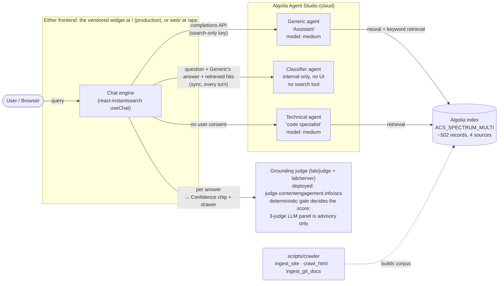
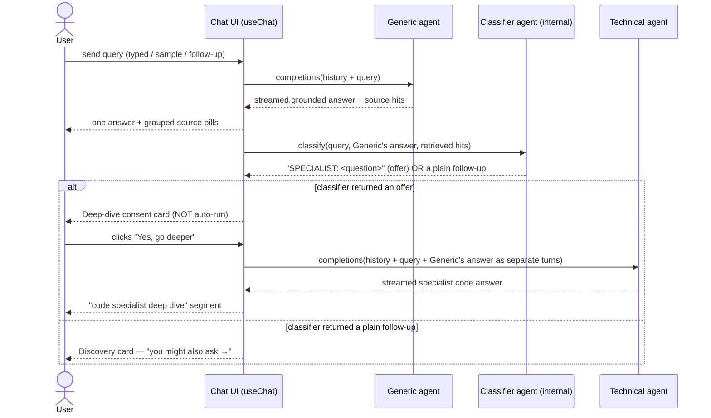

# Algolia Central — Spectrum (ACS)

A **strictly-grounded RAG chat app**: ask anything about the Adobe Spectrum design system and React Spectrum, and get an answer that is **retrieved from the real docs and cites its sources** — never invented. Built as an Algolia × Adobe co-branded demo of Algolia [Agent Studio](https://www.algolia.com/) sitting on top of an Algolia index.

It is one concrete instance of a reusable **`Algolia-Central-[Company]`** pattern: a client-branded search-answer screen where every answer is grounded in that client's own corpus.

> **Live demo:** deployed on Vercel (see [Deployment](#deployment)). **App runs locally at `http://localhost:5173`.**

---

## Algolia resources this app depends on

| What | Value |
|---|---|
| Algolia App ID | `0EXRPAXB56` |
| Index (federated, all sources) | `ACS_SPECTRUM_MULTI` |
| Search mode | `neuralSearch` (semantic + keyword) |

These two values are **not secrets** — the App ID and a search-only API key are inlined into the public browser bundle by design (that's how a browser-only Algolia app works). **Never put the admin API key here or in any other doc/commit** — it lives only in `.env.local` (gitignored) and is required by the scripts under `scripts/` to write to the index or manage agents.

---

## What it does

- **One grounded answer per question**, streamed live, with **source pills** citing the exact Spectrum docs used.
- **Human-gated deep dive** — for code-heavy questions the assistant *offers* to bring in a "code specialist"; the specialist only runs when the user clicks **Yes**. No noisy auto-relay.
- **Discovery follow-ups** — the assistant suggests a real next question you might ask (agent-generated, not canned).
- **Per-answer grounding judge** — every answer carries a **Confidence chip** (the composite score from a blind 3-judge panel, scored on a single **Usefulness** dimension under a **corroboration gate** — see [The grounding judge](#the-grounding-judge-lab) below); click it to open a drawer with the full breakdown (the Usefulness bar, the 3 judges, flagged claims with their traceable source excerpts, rationale). The judge runs locally in dev (`lab/server`); the app works without it.
- **Per-answer + session cost tracking** — a **Cost badge** next to the Confidence chip shows this answer's EXACT judge token cost and ESTIMATED agent cost; the header's **Cost page** totals everything for the session, broken out by kind and method.
- **Refuses when it can't ground** — if the corpus doesn't cover it, the assistant says so instead of hallucinating.

---

## Architecture

**Two frontends, one backend.** Production at `/` (`algolia-central-spectrum.vercel.app`) serves the
**vendored Algolia-engineering chat widget** — that is what a visitor sees today. `web/`, described
in this section, is the second frontend: a full-screen variant served at `/app`, built directly on
Algolia's own frontend primitives. Both talk to the exact same backend — the same 3 Agent Studio
agents, the same Algolia index, the same grounding judge — so everything below (the agents, the
retrieval flow, the judge, the corpus) is equally true of what powers `/`. Only the rendering layer
differs. See [Deployment](#deployment) for how each is built and shipped, and `vendor/README.md`
for the widget itself.

One visual detail carries across both frontends: the generalist agent's answer card carries a blue
filled pill and an Algolia-blue shadow falling to the right; the specialist agent's card carries a
violet filled pill and an Adobe-red shadow falling to the left — colour and shadow direction agree
with the label, so which agent answered is legible before you read a word of the response.

The browser talks **directly** to Algolia Agent Studio (using a search-only key) — there is no backend server for the chat itself. Agent Studio does the retrieval against the Algolia index and runs the LLM. There are **three Agent Studio agents**: two visible (Generic + Technical) and an invisible classifier that decides whether to offer the deep dive (see [The deep-dive offer](#the-deep-dive-offer) below). The judge is a separate hosted service.

`web/`'s chat runs on Algolia's own frontend primitive — **`react-instantsearch`'s `useChat`** (`compatibilityMode=ai-sdk-5`) — for transport and streaming, rendered through ACS's presentational components (`ChatPanel`/`ChatMessage`/`SourcePills`). `useChat` (`web/src/hooks/useChat.tsx`) drives two `useChat` instances — one per visible agent — and `lib/chatTurns.ts` maps their state into the `ChatTurn[]` the UI renders. The classifier's offer decision is a separate, non-streaming Agent Studio call (`lib/classifier.ts`, via `lib/agentStudio.ts`). The vendored widget at `/` implements the same flow independently, in its own components — see `vendor/README.md`.


```mermaid
flowchart LR
  U([User / Browser])
  subgraph Client["Either frontend: the vendored widget at / (production), or web/ at /app"]
    APP["Chat engine<br/>(react-instantsearch useChat)"]
  end
  subgraph AS["Algolia Agent Studio (cloud)"]
    GEN["Generic agent<br/>'Assistant'<br/>model: medium"]
    CLS["Classifier agent<br/>internal only, no UI<br/>no search tool"]
    TECH["Technical agent<br/>'code specialist'<br/>model: medium"]
  end
  IDX[("Algolia index<br/>ACS_SPECTRUM_MULTI<br/>~502 records, 4 sources")]
  JUDGE["Grounding judge (lab/judge + lab/server)<br/>deployed: judge.contentengagement.info/acs<br/>deterministic gate decides the score;<br/>3-judge LLM panel is advisory only"]
  SCR["scripts/crawler<br/>ingest_site · crawl_html · ingest_git_docs"]

  U -->|query| APP
  APP -->|"completions API<br/>(search-only key)"| GEN
  APP -->|"question + Generic's answer + retrieved hits<br/>(sync, every turn)"| CLS
  APP -->|on user consent| TECH
  GEN -->|neural + keyword retrieval| IDX
  TECH -->|retrieval| IDX
  APP -->|"per answer<br/>→ Confidence chip + drawer"| JUDGE
  SCR -.builds corpus.-> IDX
```

### A single turn (the app's core loop)


```mermaid
sequenceDiagram
  actor U as User
  participant UI as Chat UI (useChat)
  participant G as Generic agent
  participant C as Classifier agent (internal)
  participant T as Technical agent

  U->>UI: send query (typed / sample / follow-up)
  UI->>G: completions(history + query)
  G-->>UI: streamed grounded answer + source hits
  UI-->>U: one answer + grouped source pills

  UI->>C: classify(query, Generic's answer, retrieved hits)
  C-->>UI: "SPECIALIST: <question>" (offer) OR a plain follow-up

  alt classifier returned an offer
    UI-->>U: Deep-dive consent card (NOT auto-run)
    U->>UI: clicks "Yes, go deeper"
    UI->>T: completions(history + query + Generic's answer as separate turns)
    T-->>UI: streamed specialist code answer
    UI-->>U: "code specialist deep dive" segment
  else classifier returned a plain follow-up
    UI-->>U: Discovery card — "you might also ask →"
  end
```

### The deep-dive offer

The offer to bring in the code specialist is decided by a dedicated, invisible third agent, `ACS-classifier-neural`. Right after Generic's answer finishes, the client calls the classifier **synchronously** with the real question, Generic's real answer text, and the real retrieved hits. Its one-line response is parsed deterministically: `SPECIALIST: <question>` → the deep-dive consent card; anything else → an ordinary follow-up ("you might also ask →"). The classifier has no search tool and no UI. See `web/src/lib/classifier.ts` + `web/src/hooks/useChat.tsx` for the client wiring, `scripts/agents/instructions_classifier.md` for the agent's decision logic.

---

## The three agents

All three live on the same Algolia app (`0EXRPAXB56`) inside Agent Studio, built/patched in place by `scripts/agents/build_acs_agents.mjs` (PATCH, never delete+recreate — IDs stay stable across rebuilds). Current live IDs (also in `web/src/config/instances/spectrum.ts`, the single source of truth the app reads from):

| Agent | ID | Role | Source filter | Shown in UI? |
|---|---|---|---|---|
| `ACS-generic-neural` | `95826da6-d1b6-4b81-b061-bfb52b881356` | Front door — answers everything, synthesizes design + code, no source filter | none (all 3 sources) | Yes, as "Assistant" |
| `ACS-technical-neural` | `ae127977-c728-4b7c-bc15-6502a77873d1` | Deep-dive code specialist — only runs on explicit user consent | `source:"ReactSpectrumS2" OR source:"ReactSpectrumV3"` | Yes, as "code specialist" |
| `ACS-classifier-neural` | `dbb4faa9-e917-4be9-b8ee-6dfd9a81daef` | Internal only — decides the deep-dive offer per turn | n/a, no search tool | Never |

All three run `gemini-2.5-flash` — set in one place, `agentConfig.mjs`'s `MAIN_MODEL` constant.

---

## Modular design: backend vs client

This repo is two separable halves. There is **no chat server** — "the backend" is a set of cloud + tooling assets, and the client talks to them directly.

| Half | What it is | Where | Reusable? |
|---|---|---|---|
| **Backend** (the reusable core) | The 3 Agent Studio agents + the Algolia index/corpus + (optional) the grounding judge | `scripts/` (agents, corpus, neural) · `lab/` (judge) · the Algolia app itself | ✅ keep as-is |
| **Client** (the UI) | The React chat app — components, theme, the `useChat` engine | `web/` | 🔁 replaceable |

A team can **keep the backend and replace the client entirely.** The contract between them is a small, documented interface (below), not a shared codebase.

## Reuse the backend with your own client

To point any frontend at this backend you need three values + the endpoints:

| Need | Value |
|---|---|
| Algolia App ID | `0EXRPAXB56` |
| Search-only API key | browser-safe; from whoever holds it (never the admin key) |
| Agent IDs | Generic / Technical / Classifier — see [The three agents](#the-three-agents) |

**1. Talk to an agent (streaming chat).** POST to the Agent Studio completions endpoint:

```
POST https://{APP_ID}.algolia.net/agent-studio/1/agents/{AGENT_ID}/completions?compatibilityMode=ai-sdk-5
Header:  X-Algolia-API-Key: {SEARCH_ONLY_KEY}
Body:    { "messages": [ { "role": "user", "parts": [ { "type": "text", "text": "<question>" } ] } ] }
```

The response is an ai-sdk-5 UI-message stream. Two ways to consume it:
- **react-instantsearch** (what `web/` uses): `useChat({ agentId })` inside `<InstantSearch searchClient={liteClient(APP_ID, SEARCH_KEY)} indexName="ACS_SPECTRUM_MULTI">`, with `tools={createDefaultTools()}` registered — **required**, or the agent's server-side search tool-call never resolves.
- **Raw REST / any framework:** POST the URL above and parse the stream yourself.

**2. (Optional) Replicate the two-agent deep-dive flow.** After the Generic agent answers, call the **Classifier** agent (a normal non-streaming completion) with a `QUESTION / GENERIC'S ANSWER / RETRIEVED HITS` composite prompt; a `SPECIALIST:`-prefixed reply is the cue to offer the **Technical** agent. Exact prompt contract: `scripts/agents/instructions_classifier.md`. Or design your own UX — the agents are independent.

**3. (Optional) Grounding judge.** POST `/api/judge` to the judge service (`lab/server`), body `{ question, panels: [{ answer, sources }] }`, header `x-lab-key`. See [The grounding judge](#the-grounding-judge-lab).

**Swapping in your own client, step by step:**
1. Obtain the App ID, a search-only key, and the 3 agent IDs.
2. Point your client at the completions endpoint (react-instantsearch `useChat`, or raw REST).
3. (Optional) wire the classifier offer and/or the judge as above.
4. Keep `scripts/` + `lab/` to manage the agents, corpus, and judge. Replace or drop `web/`.

To change the agents' behavior/model/filters or rebuild the corpus, edit `scripts/agents/` (then run `build_acs_agents.mjs`) or `scripts/crawler/` — no client change needed.

## Quickstart

**Prerequisites:** Node `^20.19.0 || >=22.12.0` (Vite 7's actual engine requirement, verified against `web/node_modules/vite/package.json` — not Node 18, despite what an older version of this doc claimed). The Algolia app + index + 3 agents above already exist and are live — you don't need to provision them to run the chat UI.

```bash
# 1. Configure the frontend env (browser-safe, search-only key)
cd web
cp .env.local.example .env.local
#   then edit .env.local and fill in:
#     VITE_ALGOLIA_APP_ID=0EXRPAXB56
#     VITE_ALGOLIA_SEARCH_API_KEY=...   # SEARCH-ONLY key, never the admin key — mint one in the Algolia dashboard

# 2. Run the app
npm install
npm run dev            # → http://localhost:5173

# 3. (Optional) run the grounding judge in a second terminal
cd ../lab/server
npm install
npm run judge:serve    # → http://localhost:8788
```

> Hard-refresh the browser (**Cmd/Ctrl+Shift+R**) after edits — Vite HMR + Agent Studio response caching can otherwise show stale views.

### Environment variables

| Var | Where | Required | Purpose |
|---|---|---|---|
| `VITE_ALGOLIA_APP_ID` | `web/.env.local` (build-time) | ✅ | `0EXRPAXB56` — the Algolia app hosting the index + agents |
| `VITE_ALGOLIA_SEARCH_API_KEY` | `web/.env.local` (build-time) | ✅ | **Search-only** key — inlined into the browser bundle. Not the same as the admin key used by `scripts/`. |
| `VITE_JUDGE_URL` | `web/.env.local` | ⬜ | Judge base URL. Unset → `http://localhost:8788` (local judge; see [The grounding judge](#the-grounding-judge-lab)). |
| `VITE_LAB_API_KEY` | `web/.env.local` | ⬜ | Shared secret sent as `x-lab-key` to the hosted judge (browser-shipped + rate-limited). Without it the hosted judge returns 401. |
| `VITE_ACS_DEV_AGENT_IDS` | `web/.env.local` | ⬜ | Dev-only. JSON string mapping agent keys (`generic`/`technical`/`classifier`) to alternate agent IDs, e.g. `{"generic":"<dev-agent-id>"}` — for testing against disposable dev copies of an agent without touching `spectrum.ts`. Unset → live IDs (default, normal behavior). Malformed JSON logs a console error and falls back to live IDs rather than crashing. See `web/src/config/active.ts`. |

The `web/` env vars are inlined at build time, so they must be **browser-safe**. The app validates both at startup and renders a clear "Configuration error" screen (not a blank page) if either required var is missing.

`scripts/` (corpus ingestion + agent management) use a **separate** root-level `.env.local` (gitignored) with `ALGOLIA_APP_ID` + `ALGOLIA_ADMIN_API_KEY` — the admin key, never shipped anywhere client-facing.

---

## Project layout

```
Algolia-Central-Spectrum/
├── vercel.json              # Vercel: build web/ → web/dist (fixes root-build 404)
# ─── CLIENT (the UI — replaceable) ───────────────────────────────
├── web/                     # the chat app (Vite + React + TypeScript + Tailwind)
│   ├── src/
│   │   ├── App.tsx          # entry: env check, then renders ChatApp
│   │   ├── components/      # presentational UI; ChatApp is the app shell (see docs/ARCHITECTURE.md)
│   │   ├── hooks/           # useChat (the chat engine), useJudge, useCostRecording
│   │   ├── lib/             # chatTurns/chatMessage/offer (engine ↔ UI adapter), classifier, agentStudio (classifier's Agent Studio client), agents, sources, judgeClient
│   │   ├── config/          # InstanceConfig contract + the `spectrum` instance
│   │   ├── themes/          # Algolia × Adobe skin (Sora, Nebula Blue tokens)
│   │   └── styles/          # design tokens
│   └── .env.local.example
# ─── BACKEND (the reusable core — keep) ──────────────────────────
├── scripts/                 # the agents + corpus (the product a client talks to)
│   ├── crawler/             # ingest_site · crawl_html · ingest_git_docs · provision
│   ├── agents/              # build/update the 3 Agent Studio agents + their instructions
│   └── neural/              # enable neural (semantic) search on the index
├── lab/                     # the grounding judge (optional backend service)
│   ├── judge/               # provider-agnostic judge library (rubric, gate, synthesis)
│   ├── server/              # HTTP wrapper — POST /api/judge on :8788
│   └── eval/                # offline eval harness (batch scoring)
# ─────────────────────────────────────────────────────────────────
└── docs/                    # architecture notes
```

The split is physical: **`web/` is the client** (swap it for your own), **`scripts/` + `lab/` are the backend** (the Agent Studio agents, the index/corpus, and the judge). They share no code — only the documented interface in [Reuse the backend with your own client](#reuse-the-backend-with-your-own-client).

Full dir-by-dir breakdown: **[docs/ARCHITECTURE.md](docs/ARCHITECTURE.md)**. Architecture + turn-flow diagrams are the Mermaid diagrams in [Architecture](#architecture) above.

---

## The corpus

`ACS_SPECTRUM_MULTI` — **~502 records** across four sources (facet `source`), neural search on, all built by `scripts/crawler`:

| Source facet | What | Tool |
|---|---|---|
| `SpectrumDesignDocs` | GitHub `adobe/spectrum-design-data` S2 design guidance (103 records; citations repaired 2026-07-28 — 56 point at real `spectrum.adobe.com` pages, 47 at rendered GitHub blobs where no public page exists) | `ingest_git_docs.mjs` |
| `ReactSpectrumS2` | `react-spectrum.adobe.com` S2 code/API (`.md` twins) | `ingest_site.mjs` |
| `ReactSpectrumV3` | `react-spectrum.adobe.com/v3/*` (server-rendered HTML) | `crawl_html.mjs` |
| `ReactAria` | React Aria hooks/behavior docs | `ingest_site.mjs` |

> **Why three tools:** Algolia's native crawler can't crawl a domain you don't own, so third-party corpora are self-fetched and pushed via the indexing API. Sites with `llms.txt`/`.md` twins use `ingest_site.mjs`; server-rendered HTML uses `crawl_html.mjs`; Git docs use `ingest_git_docs.mjs`.

---

## The grounding judge (`lab/`)

A provider-agnostic service that grades an answer against its cited sources with a blind **3-judge panel** (Skeptic / Referee / Advocate). The rubric scores a single **Usefulness** dimension (1-10, "does this give the person everything they need to act on their question?"); grounding is not a scored number — it lives in the **corroboration gate**. A claim is gate-eligible only when a judge flags it as `contradicted` (not merely `unverifiable`) at ≥0.7 certainty, and the gate caps the score only when **≥2 of the 3 distinct judges** independently flag the same claim cluster; a lone flag surfaces as a visible **BORDERLINE** note but changes no number. Every `contradicted` flag carries a **traceable excerpt** — the exact source text that contradicts the claim, with `excerptVerified` set by a deterministic post-validator (never the LLM) confirming the excerpt is a real verbatim substring of that source.

**Two-phase grounding (current, 2026-07-28+).** A deterministic gate — verbatim check of code identifiers/CamelCase names/scaled numbers against the actual retrieved sources — is the ONLY thing allowed to cap the served score, because it is reproducible; the same clean answer measured `{3.00, 8.89}` twice on the old LLM-only gate, on identical input. The 3-judge LLM panel (Skeptic/Referee/Advocate, single **Usefulness** dimension) still runs and its findings are shown, but they are advisory only and never move the number. The served Confidence chip is binary — `✓ Grounded` or `⚖ N unverified claims` — never a decimal. Fixed 2026-07-29: a correct refusal that names a fabricated term to deny it no longer scores as the fabrication it's refuting (`lab/judge/src/detGround.ts`).

The app calls the judge per answer and surfaces the chip → **`JudgeDrawer`** on click (gate state, flagged claims + traceable excerpts, the 3 judges, rationale). The judge call also returns **exact token usage** — read straight from the provider's own response, never estimated.

The app is fully functional without the judge — unset the judge env vars and the Confidence chip simply stays inactive.

> **Deploy state (live, verified 2026-07-29):** ACS's own judge is deployed and healthy at `https://judge.contentengagement.info/acs` (`acs-lab-backend` container on the `chowmes` VPS), reporting the current commit SHA. Deploy is manual — `deploy/vps-deploy-judge.sh` — backend always ships before any client that depends on it; see `docs/DEPLOYING.md`. `acs-judge-deploy.timer` (auto-deploy) is intentionally inactive; someone must run the deploy script.

---

## Deployment

**Production today is the vendored Algolia-engineering chat widget, not `web/`.** `web/` (everything described above — `useChat`, the three agents, the classifier offer flow) is real, tested, and still fully functional, but it now serves as the **secondary full-screen variant at `/app`**, kept because it shares zero rendering code with the widget — a live fallback if the widget misbehaves. The primary surface at `/` is `vendor/algolia-central-chat-widget` (Algolia engineering's own componentized chat widget, **vendored read-only** — changes go through fork + branch + PR, never a direct edit; see `vendor/README.md`), wired to ACS's judge via its public seams (`algolia-verdict` event, `<algolia-confidence-badge>.verdict` setter) rather than any fork of its engine.

Three independent deployables, always **backend before client** — full runbook in `docs/DEPLOYING.md`:

1. **Judge** — `judge.contentengagement.info/acs`, manual deploy via SSH + `vps-deploy-judge.sh`.
2. **Widget + `/app` site** — `algolia-central-spectrum.vercel.app`. `vercel.json` sets `outputDirectory: dist-widget` and `buildCommand: bash scripts/deploy/build_prod_site.sh`, which builds the vendored widget packages, the ACS enhancement layer (judge config baked in at build time), and `web/` (based at `/app/`) in dependency order, then assembles them. Vercel auto-deploy-on-push is **deliberately disabled** (`git.deploymentEnabled.main: false`) after three unintended pushes reached production on 2026-07-28 — deploy manually with `vercel --prod --yes`.
3. **Corpus/index** — not a deploy; `ACS_SPECTRUM_MULTI` is shared live data, changes take effect immediately.

Required Vercel project env vars (not in the repo): `VITE_JUDGE_URL`, `VITE_LAB_API_KEY` (also read as `VITE_JUDGE_API_KEY` — the vendored client expects that name), `VITE_ALGOLIA_APP_ID`, `VITE_ALGOLIA_SEARCH_API_KEY`. A missing judge URL is a **hard build failure** by design (`scripts/deploy/build_prod_site.sh`) — it has already cost two hours of production reading "Grounding · unavailable" once.

---

## Known issues

- **Judge is uncalibrated on the QUALITY half.** The grounding half (the chip) is deterministic and measured (precision 1.00, recall 0.58 on a 36-case ground-truth set). The Usefulness/quality half has zero human validation — `lab/judge/src/calibration.ts` is the machinery; it needs a proper pairwise comparison over a stratified sample, not just the existing n=12 ranking tool.
- **`acs-judge-deploy.timer` is inactive.** The judge does not auto-update; someone must run `docs/DEPLOYING.md`'s deploy script, or it silently drifts behind `main` again (already happened once — 20 commits).
- **Corpus carries some internal hosts.** 106 records mention `s2.spectrum.corp.adobe.com`, 87 mention `adobe.enterprise.slack.com`, inside indexed body text. Guarded at the agent-prompt level (never emitted in answers); the durable fix is a re-ingest that strips these at the source, deferred by size (~502 records).
- **Answer latency varies with the inference provider**, not with instruction length (measured and ruled out 2026-07-29) — observed range ~4.3s–59s on `medium`. Not yet mitigated; the client's stream timeout can render "Couldn't reach the Assistant agent" on a stream that was actually still working.

---

## License / status

A demonstration build. The underlying Adobe Spectrum documentation remains Adobe's; it is indexed here for the purpose of this demo and is not for public redistribution.
