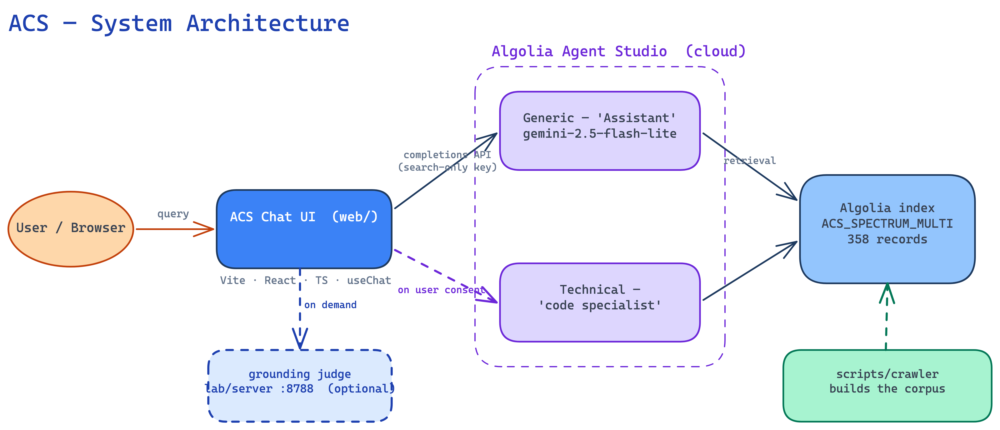
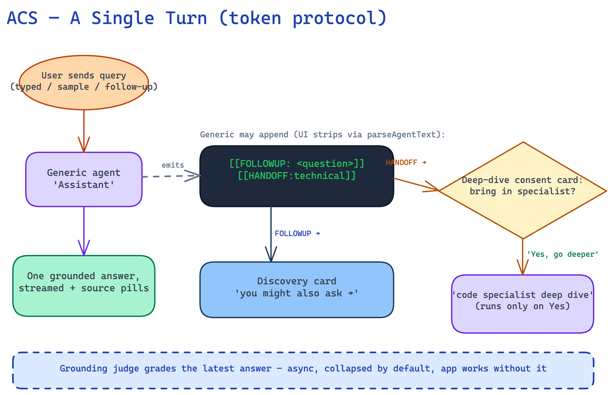

# ACS — Architecture & Code Map

A file-level map of the repo. For the big picture, see the [README](../README.md). Editable diagram sources (Excalidraw) are in [`diagrams/`](diagrams/).

### System architecture

### A single turn (token protocol)

---

## Three independent pieces

| Piece | Dir | Ships to browser? | Talks to |
|---|---|---|---|
| **Chat app** | `web/` | ✅ (static bundle) | Algolia Agent Studio directly (search-only key) |
| **Grounding judge** | `lab/` | ❌ (local/optional service) | An LLM provider; called by the app on demand |
| **Corpus + agent tooling** | `scripts/` | ❌ (dev/ops scripts) | Algolia indexing + Agent Studio admin APIs |

They are decoupled: the app runs without the judge, and the corpus is built out-of-band by the scripts.

---

## `web/` — the chat app (Vite + React + TS + Tailwind)

### Entry + shell
| File | Role |
|---|---|
| `src/main.tsx` | React entry point. |
| `src/App.tsx` | App shell — validates env at startup (renders a "Configuration error" card on failure), lays out the chat column + right judge panel, wires `useChat` callbacks to the UI. |
| `src/types.ts` | Shared types: `ChatTurn`, `AnswerSegment`, `AnswerSource`, `HistoryEntry`. |
| `index.html`, `vite.config.ts`, `tailwind.config.ts`, `postcss.config.js`, `tsconfig*.json` | Build/config. |

### `src/hooks/` — orchestration (the core logic)
| File | Role |
|---|---|
| `useChat.ts` | **The app's brain.** Owns the turn list; drives the Generic → (consent) → Technical flow. Parses agent text for the `[[HANDOFF:technical]]` and `[[FOLLOWUP:…]]` tokens (`parseAgentText`), streams answers live, normalizes/dedupes sources, and exposes `sendMessage`, `runDeepDive`, `declineDeepDive`, `retryTurn`, `reset`. The deep dive is **never** auto-run — only on explicit user consent. |
| `useJudge.ts` | Fetches an on-demand grounding verdict for a given answer from the judge service. |

### `src/lib/` — plumbing
| File | Role |
|---|---|
| `agentStudio.ts` | Agent Studio HTTP client. Builds the completions URL (`https://{APP_ID}.algolia.net/agent-studio/1/agents/{AGENT_ID}/completions?compatibilityMode=ai-sdk-4`) and streams the response. |
| `agents.ts` | Reads + validates the two required env vars (`VITE_ALGOLIA_APP_ID`, `VITE_ALGOLIA_SEARCH_API_KEY`); defines `HANDOFF_SENTINEL`; resolves per-agent `CompletionsConfig` from the active instance. |
| `sources.ts` | `normalizeHit`, `groupSources`, `totalSources` — turns raw Agent Studio hits into deduped, facet-grouped `AnswerSource[]` for the source pills. |
| `judgeClient.ts` | Thin client for the judge service (`POST /api/judge`, base URL from `VITE_JUDGE_URL` or `http://localhost:8788`). |

### `src/config/` — the instance contract (what makes it templatizable)
| File | Role |
|---|---|
| `instance.ts` | The typed `InstanceConfig` contract: branding, agent identities, sample questions, source facets, copy. Structure components read **only** from here — nothing is hardcoded. |
| `instances/spectrum.ts` | The concrete ACS instance: brand (Algolia Central × Adobe Spectrum), the two live Agent Studio agent IDs, grouped sample questions, and the three `source` facets. |
| `active.ts` | Wires the active instance + its theme together (imports `spectrum` + `themes/algolia-adobe.css`). Swapping instances = change this one file. |

### `src/components/` — presentational UI
| File | Role |
|---|---|
| `AppHeader.tsx` | Co-brand header (Adobe logo + "Search by Algolia"); logo click resets the session. |
| `ChatPanel.tsx` | Scrolling list of turns; shows `EmptyState` when idle. |
| `ChatMessage.tsx` | Renders one turn's answer segment(s) with its heading band. |
| `Composer.tsx` | The input box + Send button. |
| `SampleQuestions.tsx` | Grouped, sectioned sample-question popover above the composer. |
| `EmptyState.tsx` | First-load hero (eyebrow + heading + one chip per section). |
| `DeepDivePrompt.tsx` | The human-gated deep-dive **consent** card ("Want me to bring in the code specialist?"). |
| `DiscoveryCard.tsx` | "You might also ask →" card for the `[[FOLLOWUP:…]]` question. |
| `HandoffMarker.tsx` | Divider labelling the opted-in specialist leg ("code specialist deep dive"). |
| `SourcePills.tsx` | Grouped source citations with per-facet count badges. |
| `ThinkingIndicator.tsx` | Phased status animation during the pre-text dead-air. |
| `ErrorCard.tsx` | Answer-level error / empty-answer fallback ("No response — try again"). |
| `RightPanel.tsx` | Right column container; hosts the judge panel (collapsed by default). |
| `JudgePanel.tsx` | Recomputes + shows the grounding verdict for the latest answer. |
| `MessageMarkdown.tsx` | Markdown renderer for answer text. |
| `AgentBadge.tsx`, `PoweredByAlgolia.tsx` | Legacy/attribution atoms (see SESSION.md for current usage). |

### `src/themes/` + `src/styles/`
| File | Role |
|---|---|
| `themes/algolia-adobe.css` | **Active skin** — Algolia design system (Sora via Google Fonts, Nebula Blue `#003DFF`) over the Adobe corpus. |
| `themes/algolia.css`, `themes/spectrum.css` | Alternate skins. |
| `styles/tokens.css` | `--ac-*` design tokens components read via `var()` (never raw hex). |

> `src/_legacy_plaincss/` is the pre-Tailwind original the current app was ported from — kept for reference, not built.

---

## `lab/` — the grounding judge stack

### `lab/judge/src/` — provider-agnostic judge library
| File | Role |
|---|---|
| `index.ts` | Public entry — run a full judge pass. |
| `judge.ts` | Orchestrates a single judge run. |
| `rubric.ts` | The four scoring dimensions (Grounding / Coverage / Depth / Relevance). |
| `claimGate.ts`, `gate.ts` | The grounding **hard-gate** — unsupported claims fail the answer outright. |
| `parse.ts` | Parses the judge LLM's structured verdict. |
| `synthesis.ts`, `aggregate.ts` | Combine per-claim/per-dimension results into a final verdict. |
| `calibration.ts` | Keeps verdicts stable/reproducible. |
| `prompt.ts` | The judge prompt template. |
| `types.ts` | Judge types. |

### `lab/server/src/` — HTTP wrapper
| File | Role |
|---|---|
| `judge/`, `judgeLlm.ts`, `activeJudgeLlm.ts` | Serve `POST /api/judge` (`npm run judge:serve`, port 8788). |
| `provider.ts`, `gemini.ts`, `openai.ts` | Pluggable LLM providers. |
| `auth.ts`, `config.ts` | Server auth + config. |

### `lab/eval/src/` — offline eval harness
Batch scoring of answers (`runner.ts`, `agentRunner.ts`, `panels.ts`, `streamParser.ts`, `questions.json`, provider adapters). **Note:** a scoring-map bug in the offline path is documented in SESSION.md; the live judge path is unaffected.

---

## `scripts/` — corpus + agent tooling (not shipped)

### `scripts/crawler/`
| File | Role |
|---|---|
| `ingest_site.mjs` | Ingest a site that publishes `llms.txt` / `.md` twins. |
| `crawl_html.mjs` | BFS self-fetch + `<main>` extract for server-rendered sites (no Scout needed; how V3 was ingested). |
| `ingest_git_docs.mjs` | Ingest Markdown docs from a Git repo. |
| `provision.mjs` | Provision/configure the Algolia index. |

### `scripts/agents/`
| File | Role |
|---|---|
| `build_acs_agents.mjs` | Create the Generic + Technical Agent Studio agents. |
| `update_agent_model.mjs` | Swap an agent's model (e.g. → `gemini-2.5-flash-lite`). |
| `update_generic_prompt.mjs` | Push updated Generic instructions (adds the HANDOFF + FOLLOWUP rules). |
| `instructions_generic.md`, `instructions_technical.md`, `instructions_designer.md`, `instructions_developer.md`, `_shared_grounding_acs.md` | The agents' system instructions (grounding rules live in the shared file). |

### `scripts/neural/`
| File | Role |
|---|---|
| `seed_and_enable.mjs` | Enable neural (semantic) search on the index and seed embeddings. |

---

## Where to start reading

1. `web/src/hooks/useChat.ts` — the turn orchestration + token protocol.
2. `web/src/config/instances/spectrum.ts` — what this instance is.
3. `web/src/lib/agentStudio.ts` — how the browser calls Agent Studio.
4. `lab/judge/src/rubric.ts` + `gate.ts` — how grounding is scored.
