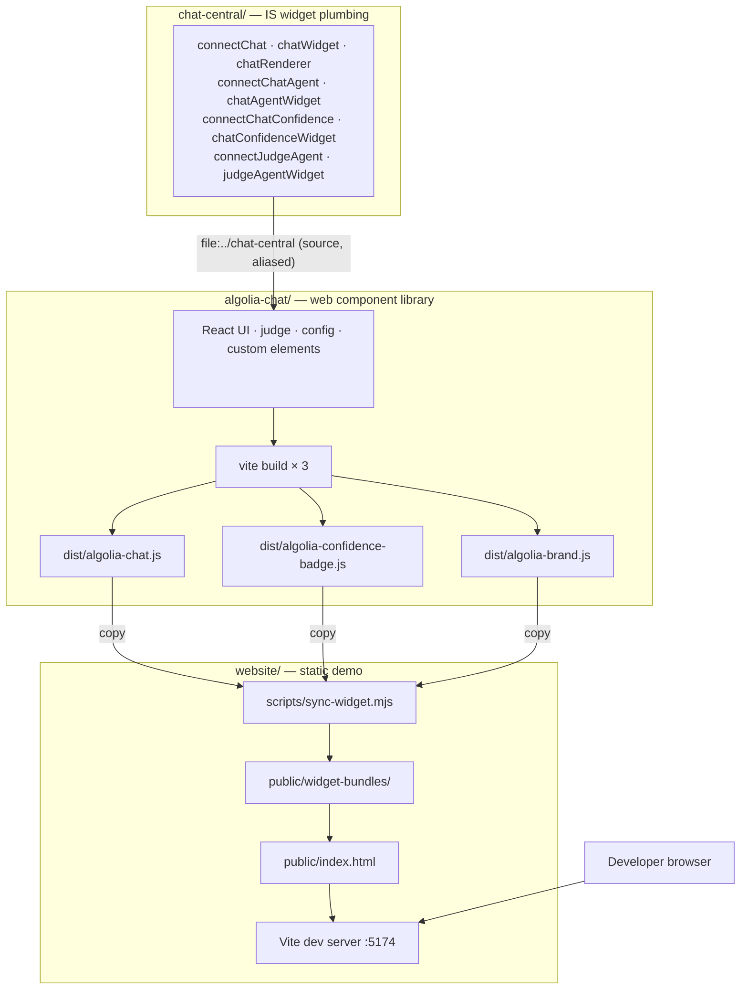
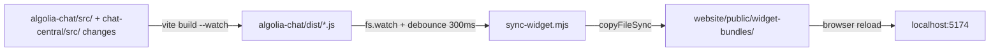

# algolia-central-chat-widget

A monorepo containing three self-contained sub-projects that together deliver an embeddable Algolia conversational assistant widget.

| Sub-project | Path | Purpose |
| --- | --- | --- |
| **chat-central** | [`chat-central/`](chat-central/) | The custom [InstantSearch.js](https://github.com/algolia/instantsearch) widget plumbing — connectors, widget factories, and a UI-agnostic React renderer harness. Framework/UI-agnostic; carries no UI, judge, or config dependencies. |
| **algolia-chat** | [`algolia-chat/`](algolia-chat/) | The distributable `<algolia-chat>` web component library. Supplies the chat UI, judge, config, and all custom elements; consumes **chat-central** as source. Compiled to self-contained IIFE bundles. |
| **website** | [`website/`](website/) | A static demo site that embeds the compiled widget via plain `<script>` tags. |

Each sub-project has its own `package.json` and is worked on independently.

`algolia-chat` depends on `chat-central` via `file:../chat-central` and bundles it from source (Vite alias + `resolve.dedupe` for a single React copy). `website` depends on `algolia-chat` via `file:../algolia-chat`.

---

## Repository architecture



---

## Widget element topology

```
<algolia-instant-search>           ROOT — owns instantsearch() + searchClient
  └─ <algolia-chat>                MAIN WIDGET + sub-orchestrator
       ├─ <algolia-chat-agent>     LEAF — chatAgentWidget (one per role)
       └─ <algolia-chat-confidence>  LEAF + parent (chatConfidenceWidget)
            └─ <algolia-judge-agent>  LEAF — judgeAgentWidget (one per judge role)
```

All leaf elements dispatch `algolia-widget-added` (bubbles: true). `<algolia-chat>` intercepts every descendant event and calls `isInstance.addWidgets([widget])`. The IS render cycle then aggregates all widget states into `renderState`, which `connectChat` reads and pushes into a reactive `WidgetStore` consumed by React via `useSyncExternalStore`.

---

## Quickstart

### 1. Install and build the widget

```bash
cd chat-central && npm install && cd ..
cd algolia-chat
npm install          # resolves @algolia-central/chat-central via file:../chat-central
npm run build
# → dist/algolia-chat.js
# → dist/algolia-confidence-badge.js
# → dist/algolia-brand.js
```

### 2. Run the demo website

```bash
cd website
npm install          # resolves @algolia-central/chat-widget via file:../algolia-chat
npm run dev          # syncs widget bundles then starts Vite at http://localhost:5174
```

Or build for static deployment:

```bash
cd website
npm run build        # → website/dist/
npm run preview      # preview the static build
```

---

## Dev watch workflow (recommended)

Two terminals:

```bash
# Terminal 1 — watches algolia-chat/src (and chat-central/src) and rebuilds on every change
node watch.mjs        # or: npm run watch

# Terminal 2 — Vite static site dev server
cd website && npm run dev
```



`watch.mjs` runs a full initial build of all three bundles then starts Vite in library watch mode for the **main chat bundle only**. Because chat-central is bundled from source, edits to `chat-central/src/` are picked up automatically. Badge and brand bundles are rebuilt with `npm run build:badge` or `npm run build:brand` in `algolia-chat/` when needed.

---

## Sub-project summaries

### chat-central/

The custom InstantSearch widget plumbing. Exports:

- **`connectChat` / `chatWidget`** — the main chat widget; `init` mounts a React tree, `render` updates the reactive store, `dispose` unmounts.
- **`connectChatAgent` / `chatAgentWidget`** — agent config carrier; publishes into `renderState.chatAgents`. Optional `container` renders a visible agent chip.
- **`connectChatConfidence` / `chatConfidenceWidget`** — judge config carrier; publishes into `renderState.chatConfidence`. Optional `container` mounts `<algolia-confidence-badge>` and keeps it live via the `algolia-verdict` document event.
- **`connectJudgeAgent` / `judgeAgentWidget`** — individual judge agent carrier; publishes into `renderState.judgeAgents`. `connectChat` merges these into `chatConfidence.agents` so `useJudge` sees the complete judge roster.
- **`createChatRenderer` / `WidgetStore`** — UI-agnostic React renderer harness with a reactive external store.

See [`chat-central/README.md`](chat-central/README.md) for full API documentation.

### algolia-chat/

The `<algolia-chat>` embeddable web component. Custom elements registered:

| Element | Role |
| --- | --- |
| `<algolia-instant-search>` | Root IS orchestrator |
| `<algolia-chat>` | Main chat widget + sub-orchestrator |
| `<algolia-chat-agent>` | Leaf: chat agent config carrier |
| `<algolia-chat-confidence>` | Leaf: judge config carrier + parent of judge-agents |
| `<algolia-judge-agent>` | Leaf: individual judge agent config carrier |
| `<algolia-confidence-badge>` | Standalone confidence badge CE (separate bundle) |
| `<algolia-brand>` | Standalone brand lockup CE (separate bundle) |

See [`algolia-chat/README.md`](algolia-chat/README.md) for embedding, attributes, slots, confidence judge, and the imperative API.

**Build outputs:**

| File | Description |
| --- | --- |
| `dist/algolia-chat.js` | Main chat widget custom element (IIFE) |
| `dist/algolia-confidence-badge.js` | Standalone confidence badge custom element (IIFE) |
| `dist/algolia-brand.js` | Standalone brand lockup custom element (IIFE) |

### website/

A static site that hosts the compiled widget as an end-consumer would. Uses a deliberate serif font and cream background to verify the widget's Shadow DOM style isolation.

See [`website/README.md`](website/README.md).

---

## Troubleshooting

### `public/widget-bundles/` is empty / missing

The `widget-bundles/` directory is git-ignored and populated by `sync-widget.mjs` at dev/build time:

1. Build the widget: `cd algolia-chat && npm run build`
2. Sync: `cd website && npm run sync:widget`

### Port conflicts

- Widget dev harness: `localhost:5173` (Vite default)
- Website dev server: `localhost:5174` (set in `website/vite.config.ts`)

Kill the process on the occupied port or override with `--port`.

### Stale bundles in the website

The website dev server does **not** hot-reload when widget source changes on its own. Use the two-terminal `node watch.mjs` workflow for automatic rebuild + sync, then manually reload the browser.

### TypeScript errors

Run `npm run typecheck` in both `chat-central/` and `algolia-chat/`. `algolia-chat` resolves `@algolia-central/chat-central` via the `tsconfig.app.json` path mapping and the Vite alias.

### `@confidence-engine` import not resolved

The `@confidence-engine` alias resolves to `src/judge/engine/index.ts` via the Vite alias in `algolia-chat/vite.config.ts`. This alias is only active during Vite builds — direct `ts-node` / `tsx` execution will fail unless the alias is added there too.
