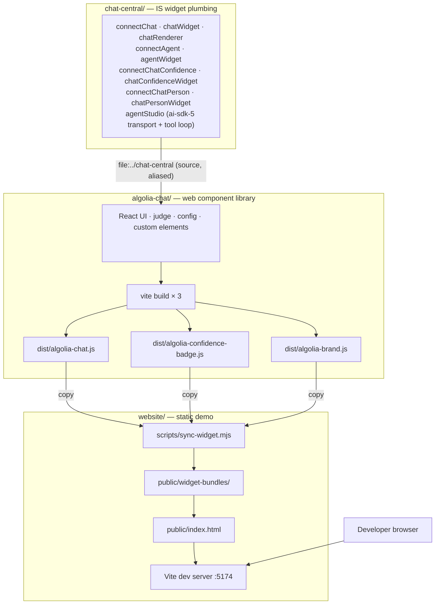
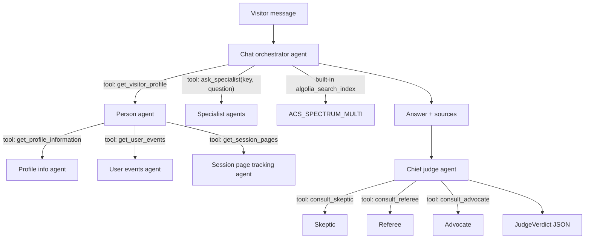
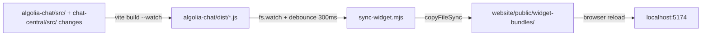

# algolia-central-chat-widget

A monorepo containing three self-contained sub-projects that together deliver an embeddable Algolia conversational assistant widget.

| Sub-project | Path | Purpose |
| --- | --- | --- |
| **chat-central** | [`chat-central/`](chat-central/) | The custom [InstantSearch.js](https://github.com/algolia/instantsearch) widget plumbing — connectors, widget factories, and a UI-agnostic React renderer harness. Framework/UI-agnostic; carries no UI, judge, or config dependencies. |
| **algolia-chat** | [`algolia-chat/`](algolia-chat/) | The distributable `<algolia-chat>` web component library. Supplies the chat UI, judge, config, and all custom elements; consumes **chat-central** as source. Compiled to self-contained IIFE bundles. |
| **website** | [`website/`](website/) | A static demo site that embeds the compiled widget via plain `<script>` tags. |

Each sub-project has its own `package.json` and is worked on independently.

`algolia-chat` depends on `chat-central` via `file:../chat-central` and bundles it from source (Vite alias + `resolve.dedupe` for a single React copy). `website` depends on `algolia-chat` via `file:../algolia-chat`.

---

## Repository architecture



---

## Widget element topology

```
<algolia-instant-search>             ROOT — owns instantsearch() + searchClient
  └─ <algolia-chat>                  MAIN WIDGET + sub-orchestrator
       ├─ <algolia-agent>            LEAF → renderState.chatAgents   (role: primary)
       │    └─ <algolia-agent>       LEAF → renderState.chatAgents   (role: specialist)
       ├─ <algolia-chat-person>      LEAF → renderState.chatPerson   (person orchestrator)
       │    └─ <algolia-agent>       LEAF → renderState.personAgents (role: profile|events|session)
       └─ <algolia-chat-confidence>  LEAF → renderState.chatConfidence
            └─ <algolia-agent>       LEAF → renderState.judgeAgents  (role: skeptic|referee|advocate)
```

One `<algolia-agent>` element serves all three positions. It picks its own context from where it sits in the DOM — inside `<algolia-chat-confidence>` it is a judge, inside `<algolia-chat-person>` a person sub-agent, anywhere else a chat agent.

Every leaf dispatches `algolia-widget-added` (bubbles: true). `<algolia-chat>` intercepts each descendant event and calls `isInstance.addWidgets([widget])`. The IS render cycle aggregates all widget states into `renderState`, which `connectChat` reads and pushes into a reactive `WidgetStore` consumed by React via `useSyncExternalStore`.

**Why leaves announce themselves rather than parents reading children:** the HTML parser upgrades a custom element at its *start tag*, so a parent inspecting its own children from `connectedCallback` finds none of them. Publishing into `renderState` and merging during the render phase sidesteps the ordering problem entirely, which is why `<algolia-chat-person>` and `<algolia-chat-confidence>` never call `querySelectorAll`.

### Architecture: single-orchestrator agents via client-side tools

The browser no longer orchestrates agent fan-out. Three **Agent Studio orchestrators** own all routing and call sub-agents through **client-side function tools** — browser functions that proxy to another agent's `/completions` endpoint. This means no MCP server needs to be deployed.



Provisioning and wiring are two steps:

```bash
ALGOLIA_ADMIN_KEY=<admin_key> npm run agents:orchestrators   # create/patch the 9 agents
npm run agents:wire                                          # push their IDs into every demo page
```

`agents:orchestrators` is idempotent — it matches existing agents by name and patches them, writing all IDs to `website/public/context/orchestrator-agents.generated.json`. `agents:wire` reads that file and repoints the primary agent, judge, and person block across all six website pages, so the IDs are never hand-copied. Both support `--dry-run`.

**Tool config format.** Agent Studio validates `tools[]` as a union discriminated on `type`, accepting only `client_side`, `algolia_search_index`, `algolia_recommend`, `algolia_display_results`, `mcp_tools`, and `unknown`. Client-side tools therefore use the flat `client_side` shape — `{ name, type, description, inputSchema }` — and **not** the OpenAI `{ type: 'function', function: {…} }` envelope that the Agent Studio *guide* shows for the dashboard UI. Posting `type: 'function'` fails with a 422. The API also caps `name` at 32 characters and `description` at 200; `schemas.js` asserts both up front so a violation names the offending tool instead of surfacing as a wall of validation JSON.

---

## Quickstart

### 1. Install and build the widget

```bash
cd chat-central && npm install && cd ..
cd algolia-chat
npm install          # resolves @algolia-central/chat-central via file:../chat-central
npm run build
# → dist/algolia-chat.js
# → dist/algolia-confidence-badge.js
# → dist/algolia-brand.js
```

### 2. Run the demo website

```bash
cd website
npm install          # resolves @algolia-central/chat-widget via file:../algolia-chat
npm run dev          # syncs widget bundles then starts Vite at http://localhost:5174
```

Or build for static deployment:

```bash
cd website
npm run build        # → website/dist/
npm run preview      # preview the static build
```

---

## Dev watch workflow (recommended)

Two terminals:

```bash
# Terminal 1 — watches algolia-chat/src (and chat-central/src) and rebuilds on every change
node watch.mjs        # or: npm run watch

# Terminal 2 — Vite static site dev server
cd website && npm run dev
```



`watch.mjs` runs a full initial build of all three bundles then starts Vite in library watch mode for the **main chat bundle only**. Because chat-central is bundled from source, edits to `chat-central/src/` are picked up automatically. Badge and brand bundles are rebuilt with `npm run build:badge` or `npm run build:brand` in `algolia-chat/` when needed.

---

## Linting and formatting

Every project — the root scripts and Playwright suite, `chat-central`, `algolia-chat`, and `website` — is linted by ESLint and formatted by Prettier.

```bash
npm run lint:all        # ESLint across all four projects
npm run lint:all:fix    # …and apply the autofixes
npm run format          # Prettier --write across the repo
npm run format:check    # Prettier in check mode (use this in CI)
npm run typecheck:all   # tsc --noEmit in every project that has TypeScript
npm run verify          # format:check + lint:all + typecheck:all
```

Each project also has its own `lint`, `lint:fix`, `format`, and `format:check` scripts, so you can work inside one project without running the whole repo.

### Shared configuration

Rules live in one place — `eslint.config.base.js` at the repo root — and each project's `eslint.config.js` imports it. `createBaseConfig()` covers the common case (type-aware TypeScript, optionally React); the exported `complexityRules`, `qualityRules`, and `typeAwareRules` objects are there for projects that assemble their own blocks, such as `website`, which mixes browser modules, Node scripts, and a Vite config in one folder.

Because the base config lives at the root, ESLint and its plugins are installed **once** at the root. Run `npm install` there before linting a sub-project.

Prettier options are likewise defined once, in the root `.prettierrc.json`, which Prettier finds by walking up from each file. Ignore patterns cannot work that way — Prettier reads them relative to the directory it runs in — so each project keeps its own `.prettierignore`.

**HTML, CSS, and Markdown are not formatted yet.** Adopting Prettier there would rewrite every demo page and README in a single commit, so those extensions are listed in each `.prettierignore`. To take that diff, delete the three lines at the bottom of each file and run `npm run format`; nothing else needs to change.

### Complexity budget

The rules below are what keep functions small enough to hold in your head, and they apply to every project:

| Rule | Limit | Why |
| --- | --- | --- |
| `complexity` | 8 | Below McCabe's classic 10. Past ~8 branches, a function needs enough test cases that splitting it is cheaper. |
| `sonarjs/cognitive-complexity` | 15 | Weighs nesting rather than raw branch count, so it catches deeply nested conditionals that `complexity` scores as cheap. |
| `max-depth` | 3 | |
| `max-nested-callbacks` | 3 | Relaxed to 4 in Playwright specs, where `describe > test > page.evaluate > callback` is four deep before a spec does anything. |
| `max-params` | 4 | Pass an options object instead. |
| `max-statements` | 25 | |
| `max-lines-per-function` | 100 | Off in test files, where a linear arrange/act/assert body reads better than indirection. |
| `max-lines` | 500 | A **warning**, not an error — a nudge to split a module, not a gate. |

### Pre-commit hook

Husky and lint-staged live at the repo root and cover all four projects. On commit, staged files are run through `eslint --fix` and `prettier --write`; a violation ESLint cannot fix aborts the commit. lint-staged picks the nearest `.lintstagedrc.json`, so a file in `chat-central/` is linted with that project's config and working directory.

---

## Sub-project summaries

### chat-central/

The custom InstantSearch widget plumbing. Exports:

- **`connectChat` / `chatWidget`** — the main chat widget; `init` mounts a React tree, `render` updates the reactive store, `dispose` unmounts. Also merges leaf agent state into the confidence and person descriptors.
- **`connectAgent` / `agentWidget`** — one agent config carrier for all three contexts, publishing into `renderState.chatAgents`, `renderState.judgeAgents`, or `renderState.personAgents` depending on the `context` param.
- **`connectChatConfidence` / `chatConfidenceWidget`** — judge config carrier; publishes into `renderState.chatConfidence`. Optional `container` mounts `<algolia-confidence-badge>` and keeps it live via the `algolia-verdict` document event.
- **`connectChatPerson` / `chatPersonWidget`** — person orchestrator config carrier; publishes into `renderState.chatPerson`, which gates whether the `get_visitor_profile` tool is registered at all.
- **`agentStudio`** — the ai-sdk-5 completions transport: SSE parsing, and `runToolLoop`, which executes client-side tool handlers and feeds their results back to the agent.
- **`createChatRenderer` / `WidgetStore`** — UI-agnostic React renderer harness with a reactive external store.

See [`chat-central/README.md`](chat-central/README.md) for full API documentation.

### algolia-chat/

The `<algolia-chat>` embeddable web component. Custom elements registered:

| Element | Role |
| --- | --- |
| `<algolia-instant-search>` | Root IS orchestrator |
| `<algolia-chat>` | Main chat widget + sub-orchestrator |
| `<algolia-agent>` | Leaf agent config carrier. Context is detected from DOM position: chat agent, judge agent, or person sub-agent |
| `<algolia-chat-person>` | Person orchestrator config carrier + parent of person sub-agents |
| `<algolia-chat-confidence>` | Leaf: judge config carrier + parent of judge agents |
| `<algolia-confidence-badge>` | Standalone confidence badge CE (separate bundle) |
| `<algolia-brand>` | Standalone brand lockup CE (separate bundle) |

See [`algolia-chat/README.md`](algolia-chat/README.md) for embedding, attributes, slots, confidence judge, and the imperative API.

**Build outputs:**

| File | Description |
| --- | --- |
| `dist/algolia-chat.js` | Main chat widget custom element (IIFE) |
| `dist/algolia-confidence-badge.js` | Standalone confidence badge custom element (IIFE) |
| `dist/algolia-brand.js` | Standalone brand lockup custom element (IIFE) |

### website/

A static site that hosts the compiled widget as an end-consumer would. Uses a deliberate serif font and cream background to verify the widget's Shadow DOM style isolation.

See [`website/README.md`](website/README.md).

---

## Troubleshooting

### `public/widget-bundles/` is empty / missing

The `widget-bundles/` directory is git-ignored and populated by `sync-widget.mjs` at dev/build time:

1. Build the widget: `cd algolia-chat && npm run build`
2. Sync: `cd website && npm run sync:widget`

### Port conflicts

- Widget dev harness: `localhost:5173` (Vite default)
- Website dev server: `localhost:5174` (set in `website/vite.config.ts`)

Kill the process on the occupied port or override with `--port`.

### Stale bundles in the website

The website dev server does **not** hot-reload when widget source changes on its own. Use the two-terminal `node watch.mjs` workflow for automatic rebuild + sync, then manually reload the browser.

### TypeScript errors

Run `npm run typecheck` in both `chat-central/` and `algolia-chat/`. `algolia-chat` resolves `@algolia-central/chat-central` via the `tsconfig.app.json` path mapping and the Vite alias.

Note that `chat-central/src/tools/schemas.js` is plain JavaScript and is **not** covered by `tsc` — it is imported directly by the Node provisioning script. Run `node -e "import('./chat-central/src/tools/schemas.js')"` to check it parses.

### `npm run agents:orchestrators` fails

The script needs an Algolia **admin** key, via `ALGOLIA_ADMIN_KEY` or as the first argument. It reads its tool schemas from `chat-central/src/tools/schemas.js`, so a syntax error there surfaces here first.

A `422` naming a tool `type` means a tool config used a tag the API does not accept — see the format note above. A `422` mentioning `description` length means a description exceeded 200 characters.

If a run creates duplicate agents instead of patching, the name lookup is failing. The list endpoint nests rows under `data` (not `agents`) and pages at 10 with no way to raise the limit, so both the key and the pagination have to be right or every run silently creates a second copy of each agent.

### Person agent never supplies a profile

`get_visitor_profile` is only registered when a `<algolia-chat-person>` element with a valid `agent-id` is present — without it the orchestrator is never told the tool exists. Sub-agents are read from `renderState.personAgents`, not from the DOM, so each `<algolia-agent>` child needs a `role` of `profile`, `events`, or `session` to be picked up.

### Breaking changes from the pre-orchestrator architecture

| What changed | Migration |
| --- | --- |
| `role="classifier"` agent removed | Remove `<algolia-agent role="classifier">` from your embed. The orchestrator agent handles routing itself. |
| Deep-dive offer is orchestrator-driven | The card appears only when the primary agent calls `ask_specialist`. `runDeepDive()` resumes the gated tool call; `declineDeepDive()` cancels it. No client-side fallback. |
| `setContextProvider()` superseded | Use `setVisitorDataSource(source)` and `<algolia-chat-person>` elements instead. Visitor data is now fetched on-demand by the person agent tool, not injected as a preamble on every turn. |
| `@confidence-engine` alias removed | The vendored judge engine has been deleted. The chief judge agent orchestrates sub-judges via client-side tools. |
