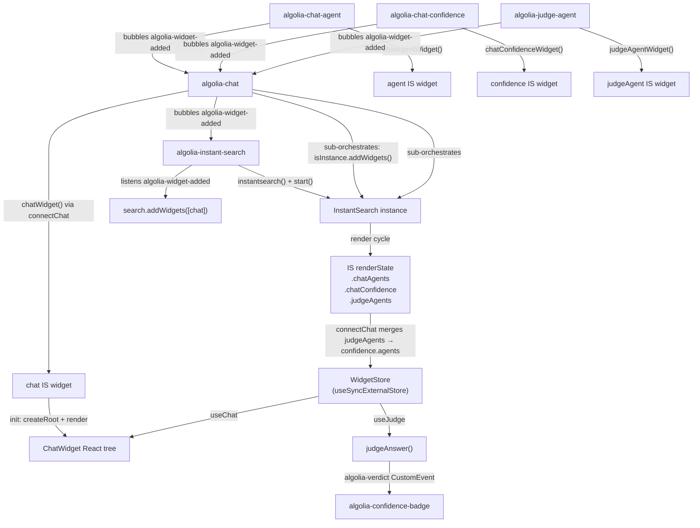
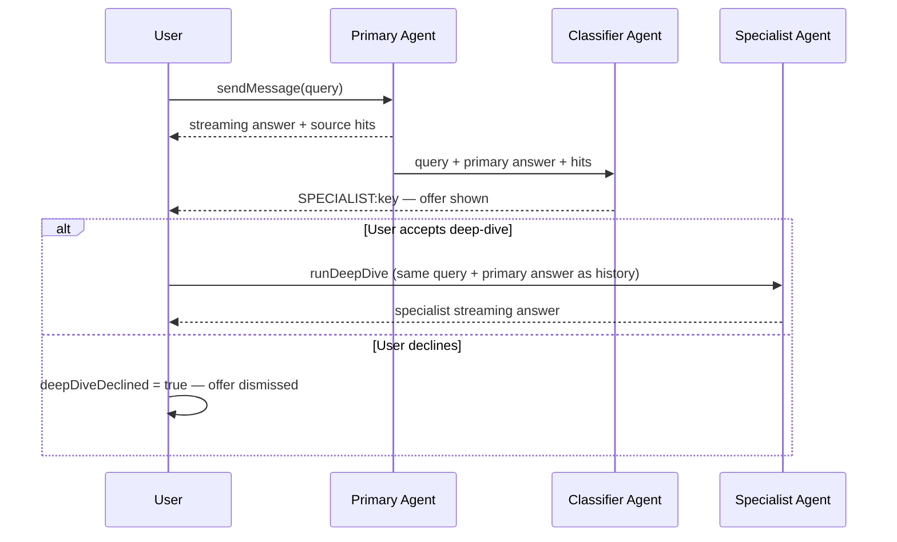
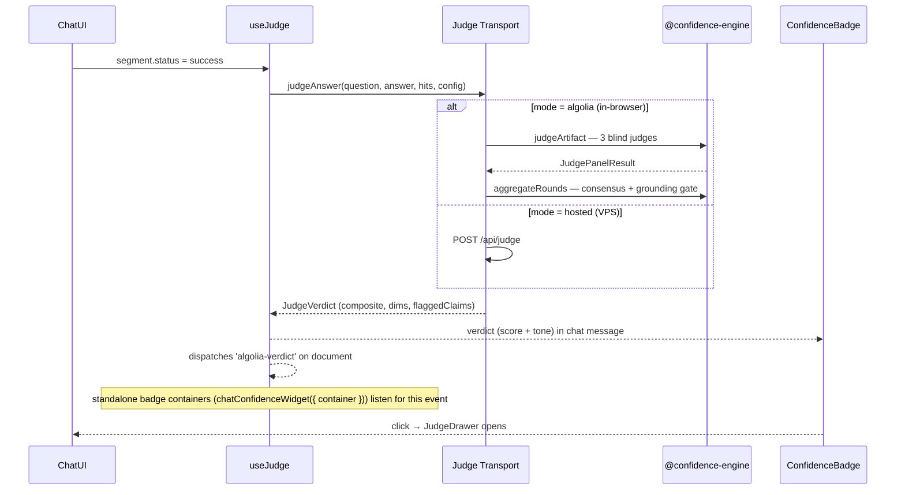
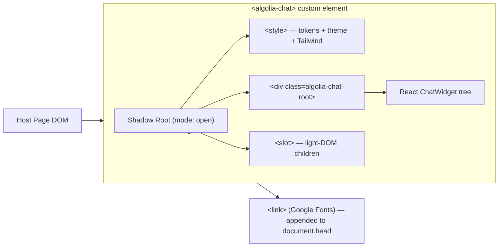

# @algolia-central/chat-widget

An embeddable **`<algolia-chat>`** web component that drops a grounded conversational assistant onto any site with a single `<script>` tag.

Implements a full custom chat experience: streaming answers from Algolia Agent Studio, a Primary → Specialist deep-dive handoff gated by the user, and an optional **Confidence judge** (3-judge panel that scores each answer for grounding). Everything renders inside a **Shadow DOM** so the widget never clashes with the host page's CSS.

This package is the **custom-element / attribute layer** — it registers HTML elements, parses their attributes, and delegates all implementation to the sibling [`@algolia-central/chat-central`](../chat-central) package. chat-central contains the React chat UI, configuration system, judge engine, shared transports, and widget styles. This package bundles chat-central from source so the final IIFE is self-contained.

---

## Quickstart

```bash
npm install
npm run dev          # dev harness at index.html (localhost:5173)
npm run build        # → dist/algolia-chat.js + dist/algolia-confidence-badge.js + dist/algolia-brand.js
npm run typecheck
npm run lint
```

Open the [`../website/`](../website/) project after building to verify style isolation against a deliberately clashing host page.

---

## Build outputs

| Command                | Output file                        | Description                                       |
| ---------------------- | ---------------------------------- | ------------------------------------------------- |
| `npm run build:widget` | `dist/algolia-chat.js`             | Main chat widget custom element (IIFE)            |
| `npm run build:badge`  | `dist/algolia-confidence-badge.js` | Standalone confidence badge custom element (IIFE) |
| `npm run build:brand`  | `dist/algolia-brand.js`            | Standalone brand lockup custom element (IIFE)     |
| `npm run build`        | All three above                    |                                                   |

---

## Architecture overview

The widget uses an **AEM-style InstantSearch web-component topology** following Algolia's [Create your own widgets](https://www.algolia.com/doc/guides/building-search-ui/widgets/create-your-own-widgets/js) pattern. InstantSearch serves as the orchestration/lifecycle layer only — it does not consume search results; the chat talks exclusively to Agent Studio.

### Element hierarchy

```
<algolia-instant-search>           ROOT — owns instantsearch() instance
  └─ <algolia-chat>                MAIN WIDGET + sub-orchestrator
       ├─ <algolia-agent>          LEAF chat agent — chatAgentWidget (display:none)
       ├─ <algolia-agent>          any number of specialists / classifier
       └─ <algolia-chat-confidence>  LEAF confidence — chatConfidenceWidget (display:none)
            ├─ <algolia-agent>     LEAF judge agent — detected by closest() context
            ├─ <algolia-agent>     one per temperament (skeptic/referee/advocate)
            └─ <algolia-agent>     or omit children for single-agent shorthand
```

A single `<algolia-agent>` element handles both chat agents and judge agents. Its context is determined automatically by DOM position: inside `<algolia-chat-confidence>` → judge agent; elsewhere → chat agent.

### Widget flow



### Sub-orchestration: how child widget events propagate

All leaf elements (`<algolia-chat-agent>`, `<algolia-chat-confidence>`, `<algolia-judge-agent>`) dispatch `algolia-widget-added` (bubbles: true). The `<algolia-chat>` element intercepts every such event from its descendants and calls `isInstance.addWidgets([event.detail])`. No additional listener is needed on `<algolia-chat-confidence>` — judge-agent events bubble straight through it to `<algolia-chat>`.

### Backward-compatible single-element embed

If `<algolia-chat>` has no `<algolia-instant-search>` ancestor (legacy single-tag embed), it automatically creates and wraps itself in a root element. All existing single-element embeds keep working unchanged.

---

## Source directory layout

This package is intentionally thin. All implementation logic lives in `@algolia-central/chat-central`.

### algolia-chat (this package) — custom-element layer

| Concern                                                 | Path                                                                        |
| ------------------------------------------------------- | --------------------------------------------------------------------------- |
| `<algolia-chat>` custom element + attribute parsing     | `src/chat-embed.tsx`                                                        |
| `<algolia-instant-search>` root IS orchestrator         | `src/instantsearch/InstantSearchElement.ts`                                 |
| IS lifecycle event constants                            | `src/instantsearch/constants.ts`                                            |
| `<algolia-agent>` — chat + judge agent element          | `src/chat/AgentElement.ts`                                                  |
| `<algolia-chat-confidence>` — confidence config element | `src/chat/ConfidenceElement.ts`                                             |
| `<algolia-confidence-badge>` custom element             | `src/judge/badge/ConfidenceBadgeElement.ts`                                 |
| `<algolia-brand>` standalone brand lockup element       | `src/brand/BrandElement.ts`                                                 |
| Build configs (IIFE bundles)                            | `vite.config.ts`, `vite.confidence-badge.config.ts`, `vite.brand.config.ts` |

### chat-central (sibling package) — widget engine

| Concern                                                               | Path in chat-central/src                                        |
| --------------------------------------------------------------------- | --------------------------------------------------------------- |
| IS connectors: `connectChat`, `connectAgent`, `connectChatConfidence` | `connectChat.ts`, `connectAgent.ts`, `connectChatConfidence.ts` |
| Widget factories: `chatWidget`, `agentWidget`, `chatConfidenceWidget` | `chatWidget.ts`, `agentWidget.ts`, `chatConfidenceWidget.ts`    |
| React renderer harness                                                | `chatRenderer.tsx`                                              |
| Built-in React chat UI (`ChatWidget` + all components)                | `chat/`                                                         |
| Configuration system (types, defaults, runtime store, strings)        | `config/`                                                       |
| Judge engine (vendored), clients, hooks, components                   | `judge/`                                                        |
| Agent Studio completions client + env plumbing                        | `shared/`                                                       |
| Style helpers (`buildWidgetStyles`, `ensureWidgetFont`)               | `styles.ts`, `styles/`                                          |
| Public barrel exports                                                 | `index.ts`                                                      |

---

## Chat flow



Deep-dive is always **human-gated** — the specialist never runs until the user explicitly clicks accept. The classifier's `SPECIALIST:<key>` line identifies which specialist to route to; it defaults to the first specialist when the key is absent or unknown.

---

## Judge flow



The grounding **hard gate** caps any answer with a verified unsupported claim to ≤ 3/10 regardless of prose quality.

---

## Shadow DOM mount



All CSS is injected into the Shadow Root for full style isolation. Fonts load via `document.head` because Shadow Roots cannot reliably `@import` web fonts.

---

## Embedding

### Two-tier layout with three-judge panel (preferred)

```html
<!-- Load bundles — confidence badge first, chat second -->
<script src="/widget-bundles/algolia-confidence-badge.js"></script>
<script src="/widget-bundles/algolia-chat.js"></script>

<algolia-instant-search app-id="YOUR_APP_ID" api-key="YOUR_SEARCH_ONLY_KEY" index-name="YOUR_INDEX">
  <algolia-chat
    accent-color="#003DFF"
    brand-name="Algolia"
    product-title="Your Product"
    subtitle="Product docs"
    corpus-name="Product knowledge base"
    disclaimer="Every answer cites its source."
    powered-by-logo="/brand/algolia-mark.svg"
  >
    <!-- Chat agents -->
    <algolia-agent role="primary" agent-id="PRIMARY_UUID" label="Assistant"></algolia-agent>
    <algolia-agent
      role="specialist"
      key="code"
      agent-id="CODE_UUID"
      label="Code expert"
      accent-token="--algolia-agent-specialist"
    ></algolia-agent>
    <algolia-agent role="classifier" agent-id="CLASSIFIER_UUID"></algolia-agent>

    <!-- Confidence widget — three-judge panel (one agent per temperament) -->
    <algolia-chat-confidence mode="algolia">
      <algolia-agent role="skeptic" agent-id="SKEPTIC_UUID" label="Skeptic"></algolia-agent>
      <algolia-agent role="referee" agent-id="REFEREE_UUID" label="Referee"></algolia-agent>
      <algolia-agent role="advocate" agent-id="ADVOCATE_UUID" label="Advocate"></algolia-agent>
    </algolia-chat-confidence>

    <!-- Optional slots -->
    

    <div
      slot="welcome"
      style="display:flex;flex-direction:column;align-items:center;gap:12px;text-align:center;"
    >
      <h2 style="margin:0;font-weight:700;">Hello, how can I help you?</h2>
    </div>

    <div slot="sample-questions">
      <section data-title="Getting started">
        <button>How do I install this?</button>
        <button>What are the key concepts?</button>
      </section>
    </div>

    <div slot="source-facets">
      <span data-value="Docs">Documentation</span>
    </div>

    <script type="application/json" slot="strings">
      { "composer": { "placeholder": "Ask a question…" } }
    </script>
  </algolia-chat>
</algolia-instant-search>
```

### Single judge agent (shorthand)

When one agent covers all three judge temperaments, declare it directly on `<algolia-chat-confidence>` without child elements:

```html
<algolia-chat-confidence mode="algolia" agent-id="JUDGE_UUID"> </algolia-chat-confidence>
```

### Hosted judge service

```html
<algolia-chat-confidence
  mode="hosted"
  url="https://judge.example.com"
  api-key="YOUR_JUDGE_API_KEY"
></algolia-chat-confidence>
```

### Single-element layout (backward-compat)

`<algolia-chat>` self-hosts an IS instance when no root ancestor is present:

```html
<algolia-chat
  app-id="YOUR_APP_ID"
  search-api-key="YOUR_SEARCH_ONLY_KEY"
  index-name="YOUR_INDEX"
  accent-color="#003DFF"
  product-title="Your Product"
  judge-mode="algolia"
  judge-agent-id="JUDGE_UUID"
>
  <algolia-agent role="primary" agent-id="PRIMARY_UUID"></algolia-agent>
</algolia-chat>
```

> **Security:** always use a **search-only** API key. Never use an admin key in the browser.

---

## Attribute reference

### `<algolia-instant-search>`

| Attribute    | Required | Description                                                        |
| ------------ | -------- | ------------------------------------------------------------------ |
| `app-id`     | yes      | Algolia application ID                                             |
| `api-key`    | yes      | Browser-safe search-only API key (alias: `search-api-key`)         |
| `index-name` | yes      | Index name (initialises the IS instance)                           |

All three are read once, when the element connects. Changing one afterwards is
reported in the console and ignored — the search client and every widget the
descendants registered are already built from the previous value, so switching
application or index means removing and re-inserting the element.

### `<algolia-chat>`

| Attribute          | Required            | Description                                                               |
| ------------------ | ------------------- | ------------------------------------------------------------------------- |
| `accent-color`     | no                  | Brand accent hex (drives `--algolia-accent` and related tokens)           |
| `brand-name`       | no                  | Label shown in the header                                                 |
| `product-title`    | no                  | Chat header title                                                         |
| `subtitle`         | no                  | Subtitle under the product title                                          |
| `corpus-name`      | no                  | Human name of the knowledge corpus (used in empty-state copy)             |
| `disclaimer`       | no                  | Trust disclaimer shown on the welcome screen                              |
| `logo`             | no                  | Header logo URL (or use the `logo` slot)                                  |
| `logo-mark`        | no                  | Small brand mark URL (or use the `logo-mark` slot). Defaults to `logo`     |
| `theme`            | no                  | `"algolia"` (default) \| `"spectrum"`. An unknown name is reported and ignored — use `<style slot="theme">` for a custom design system |
| `show-welcome`     | no                  | `"false"` hides the welcome hero (default: shown)                          |
| `agents`           | no                  | JSON agent config — the single-attribute alternative to `<algolia-agent>` children (see below) |
| `new-chat-icon`    | no                  | "New conversation" button icon URL (or use the `new-chat-icon` slot; falls back to a built-in glyph) |
| `launcher-icon`    | no                  | Collapsed launcher button icon URL (or use the `launcher-icon` slot; falls back to the built-in Algolia mark) |
| `auto-engage-toggle` | no                | Presence shows a header control letting visitors disable proactive auto-opening |
| `auto-engage`      | no                  | `"false"` ships proactive auto-opening off until a visitor enables it (default: on). A stored visitor choice always wins |
| `analyzing-timeout` | no                 | Milliseconds before a stuck analyzing indicator clears itself (default: `30000`) |
| `powered-by-label` | no                  | "Powered by Algolia" text override (default: `"Powered by Algolia"`)      |
| `powered-by-logo`  | no                  | "Powered by Algolia" mark URL                                             |
| `font-href`        | no                  | Custom font stylesheet URL (default: Google Fonts Sora + JetBrains Mono)  |
| `sample-questions` | no                  | JSON `[{ "section", "questions": [] }]` (or use the slot)                 |
| `source-facets`    | no                  | JSON `[{ "value", "label" }]` (or use the slot)                           |
| `app-id`           | single-element only | Algolia application ID                                                    |
| `search-api-key`   | single-element only | Search-only API key (alias: `api-key`)                                    |
| `index-name`       | single-element only | Index name                                                                |
| `judge-mode`       | backward-compat     | `"algolia"` \| `"hosted"` \| `"off"` (prefer `<algolia-chat-confidence>`) |
| `judge-agent-id`   | backward-compat     | Agent Studio UUID for the judge (prefer `<algolia-chat-confidence>`)      |
| `judge-url`        | backward-compat     | Hosted judge service URL                                                  |
| `judge-api-key`    | backward-compat     | Auth key for the hosted judge service                                     |

#### Reconfiguring a mounted widget

Every attribute above is observed, so config is not frozen at mount. Change a
branding, copy, or behaviour attribute and the panel re-renders with the new
value — no remount, and an open conversation is preserved:

```js
const widget = document.querySelector('algolia-chat');
widget.setAttribute('product-title', 'Spectrum 2');
widget.setAttribute('accent-color', '#e2361b');
widget.setAttribute('strings', JSON.stringify({ header: { newChat: 'Nouvelle discussion' } }));
```

The exceptions are the credential attributes (`app-id`, `search-api-key` /
`api-key`, `index-name`), which are structural: they build the search client and
the agent transport once. Changing one logs a warning saying so rather than
appearing to work.

Config is applied as a patch, so _removing_ an attribute keeps the value it last
set rather than reverting to the built-in default. Write the value you want.

`<algolia-agent>` and `<algolia-chat-confidence>` are live too — they detach and
re-register with the new values, so you can retarget an agent or switch judging
on and off at runtime.

#### The `agents` attribute

`<algolia-agent>` children are the richer path (they participate in the widget
lifecycle), but the whole agent set can also be declared in one attribute, which
suits config rendered by a CMS or template:

```html
<algolia-chat
  app-id="…"
  search-api-key="…"
  index-name="…"
  agents='{
    "primary": { "id": "<uuid>", "label": "Assistant" },
    "classifier": { "id": "<uuid>" },
    "specialists": [{ "key": "code", "id": "<uuid>", "label": "Code expert" }]
  }'
>
</algolia-chat>
```

Each entry needs an `id`; specialists also need a `key` (their routing slug).
`label` and `accentToken` fall back to the widget defaults. Entries missing a
required field are skipped with a console warning rather than failing the embed.

### `<algolia-agent>`

A single element for both chat agents and judge agents. Context (chat vs. judge) is detected automatically from DOM position.

**Chat context** (inside `<algolia-chat>`, outside `<algolia-chat-confidence>`):

| Attribute      | Required         | Description                                                                                                  |
| -------------- | ---------------- | ------------------------------------------------------------------------------------------------------------ |
| `agent-id`     | yes              | Algolia Agent Studio agent UUID                                                                              |
| `role`         | yes              | `"primary"` \| `"specialist"` \| `"classifier"`                                                              |
| `key`          | specialists only | Unique routing slug (e.g. `"code"`, `"design"`)                                                              |
| `label`        | no               | Display name (default: `"Assistant"` for primary, `"Classifier"` for classifier, key for specialist)         |
| `accent-token` | no               | `--algolia-*` property for accent colour (default: `--algolia-agent-primary` / `--algolia-agent-specialist`) |

**Judge context** (inside `<algolia-chat-confidence>`):

| Attribute  | Required | Description                                                                                 |
| ---------- | -------- | ------------------------------------------------------------------------------------------- |
| `agent-id` | yes      | Algolia Agent Studio agent UUID                                                             |
| `role`     | no       | Judge temperament: `"skeptic"` \| `"referee"` \| `"advocate"`. Omit for single-agent setup. |
| `label`    | no       | Display label in the judge drawer                                                           |

### `<algolia-chat-confidence>`

| Attribute  | Required    | Description                                                                                                                           |
| ---------- | ----------- | ------------------------------------------------------------------------------------------------------------------------------------- |
| `mode`     | no          | `"algolia"` (in-browser) \| `"hosted"` (VPS, default) \| `"off"`                                                                      |
| `agent-id` | no          | Shorthand for a single judge agent (equivalent to one `<algolia-judge-agent>` child with no role)                                     |
| `agents`   | no          | JSON array of `{ "id", "role"?, "label"? }` objects — overrides `agent-id`; ignored when `<algolia-judge-agent>` children are present |
| `url`      | hosted mode | Base URL of the judge HTTP service                                                                                                    |
| `api-key`  | hosted mode | Shared secret forwarded as `x-judge-api-key`                                                                                          |

---

## Slots

| Slot               | Markup                                                                                    | Renders as                                                             |
| ------------------ | ----------------------------------------------------------------------------------------- | ---------------------------------------------------------------------- |
| `logo`             | ``                                                               | Header logo                                                            |
| `logo-mark`        | ``                                                          | Small brand mark (defaults to the header logo)                         |
| `new-chat-icon`    | ``                                                      | "New conversation" header button icon (falls back to a built-in glyph) |
| `launcher-icon`    | ``                                                      | Collapsed launcher button icon (falls back to the built-in Algolia mark) |
| `sample-questions` | `<div slot="sample-questions"><section data-title="…"><button>Q</button></section></div>` | Sample question groups in the empty state                              |
| `source-facets`    | `<div slot="source-facets"><span data-value="FacetValue">Label</span></div>`              | Source-pill filter labels                                              |
| `welcome`          | `<div slot="welcome">…</div>`                                                             | Custom welcome hero — replaces the default eyebrow/heading/description |
| `strings`          | `<script type="application/json" slot="strings">{…}</script>`                             | i18n label overrides                                                   |

Where a slot and an attribute set the same thing, the attribute wins.

Slot children are read once the document finishes parsing, so the widget scripts
may load before or after the markup. For elements you create dynamically, append
the slot children **before** inserting the element into the document — config is
read when the element connects.

Slots are read on connect and re-read whenever an attribute changes, so the way
to swap slotted config later is to update the slot child and then touch the
matching attribute (or use the attribute directly, which always wins).

---

## Welcome slot (`slot="welcome"`)

Replace the empty-state hero with any HTML:

```html
<algolia-chat …>
  <div
    slot="welcome"
    style="display:flex;flex-direction:column;align-items:center;gap:12px;text-align:center;"
  >
    
    <h2 style="margin:0;font-size:clamp(24px,3.5vw,36px);font-weight:700;">
      Hello, how can I help?
    </h2>
    <p style="margin:0;font-size:14px;color:#666;max-width:360px;">
      Ask anything about our product docs.
    </p>
  </div>
</algolia-chat>
```

The `::slotted()` rule applies `display:flex; flex-direction:column; align-items:center; gap:12px; text-align:center` to the direct slotted child. Style inner elements with inline styles (Shadow DOM blocks external CSS from reaching them).

---

## i18n string overrides (`slot="strings"`)

Every user-facing label has an English default. Override any subset via `<script type="application/json" slot="strings">` — only provided keys change:

```html
<algolia-chat …>
  <script type="application/json" slot="strings">
    {
      "composer": { "placeholder": "Posez une question…", "send": "Envoyer" },
      "empty": { "eyebrow": "Réponses fiables", "heading": "Demandez à propos de {corpus}" },
      "header": { "close": "Fermer la discussion" },
      "sources": { "heading": "Sources", "showLess": "voir moins" }
    }
  </script>
</algolia-chat>
```

For short overrides, use the `strings` attribute directly:

```html
<algolia-chat strings='{"composer":{"send":"Envoyer"}}' …></algolia-chat>
```

### Templated tokens

| Key                       | Token(s)                   | Default                                              |
| ------------------------- | -------------------------- | ---------------------------------------------------- |
| `empty.heading`           | `{corpus}`                 | `Ask about {corpus}`                                 |
| `header.resetAria`        | `{brand}`                  | `{brand} — reset conversation`                       |
| `header.logoAlt`          | `{brand}`                  | `{brand} logo`                                       |
| `thinking.phaseSearching` | `{product}`                | `Searching {product} docs`                           |
| `error.body`              | `{agent}`                  | `Couldn't reach the {agent} agent…`                  |
| `deepDive.body`           | `{specialist}`             | `For this topic, our {specialist} can go deeper…`    |
| `judge.panelHeading`      | `{count}`                  | `The panel ({count} judges)`                         |
| `judge.flaggedHeading`    | `{count}`                  | `Flagged claims ({count})`                           |
| `judge.preGateFloor`      | `{preGate}`, `{composite}` | `Panel mean was {preGate} — floored to {composite}…` |

---

## Confidence judge

When `mode` is `algolia` or `hosted`, each finished answer is scored asynchronously by a 3-judge panel:

- **Skeptic** — adversarial; assumes claims wrong until sourced. Only this judge trips the grounding gate.
- **Referee** — neutral; applies the rubric literally.
- **Advocate** — generous; rewards genuine depth, never excuses fabrication.

The composite score appears as a **Confidence badge** on each answer. Clicking the badge opens the full breakdown drawer (composite score, per-dimension bars, per-judge notes, flagged claims, synthesis rationale).

**Grounding hard gate:** any answer with a verified unsupported claim is capped at ≤ 3/10, regardless of prose quality. A fluent-but-unsourced answer cannot read green.

### Judge config priority

When the same configuration is provided in multiple ways, the following precedence applies (highest first):

1. `<algolia-judge-agent>` child elements → merged into `chatConfidence.agents` by `connectChat`
2. `agents` JSON attribute on `<algolia-chat-confidence>`
3. `agent-id` shorthand attribute on `<algolia-chat-confidence>`
4. `judge-agent-id` on `<algolia-chat>` (backward-compat attribute path)
5. `VITE_JUDGE_AGENT_ID` environment variable (build-time fallback)

---

## Standalone confidence badge

`chatConfidenceWidget({ container })` accepts an optional host-page element and mounts `<algolia-confidence-badge>` into it. The badge starts idle and updates live whenever `useJudge` fires — `useJudge` dispatches an `algolia-verdict` `CustomEvent` on `document` after each verdict, and the badge renderer subscribes to it.

```js
import { chatConfidenceWidget } from '@algolia-central/chat-central';

search.addWidgets([
  chatConfidenceWidget({
    mode: 'algolia',
    container: document.querySelector('#my-confidence-badge'),
  }),
]);
```

---

## Imperative API

```js
const widget = document.querySelector('algolia-chat');
widget.open(); // open the chat overlay
widget.ask('How do I …?'); // open and prefill a question
```

| Method                        | Description                                                                                                    |
| ----------------------------- | -------------------------------------------------------------------------------------------------------------- |
| `open()`                      | Open the chat overlay.                                                                                          |
| `ask(text)`                   | Open the overlay and send `text` as the first user message.                                                      |
| `setPersona(agentId, label?)` | Route future answers to a different Agent Studio agent. Pass `null` to restore the declared primary.             |
| `engage({ greeting, suggestions })` | Open the panel with an assistant-authored greeting and optional suggestion chips. Returns `false` if refused. |
| `setAnalyzing(analyzing)`     | Toggle a loading indicator on the collapsed launcher while an upstream decision is pending.                       |
| `setAutoEngage(enabled)`      | Set the visitor's auto-engage preference (persisted). Also available as the `autoEngage` property.                 |
| `autoEngage`                  | Property: whether the visitor currently allows the chat to open itself. Readable and writable before mount.        |
| `setContextProvider(fn)`      | Send what the host knows about the visitor with every question. Pass `null` to stop.                              |

All methods are **safe to call before the widget has mounted**. The custom element
upgrades synchronously but its React tree mounts asynchronously, so commands issued
early are buffered and replayed once the internal API is live. Host pages never need
to poll for readiness or guess a delay.

You do still need the element to exist in the DOM. Note that `algolia-chat.js` is
normally loaded *above* the `<algolia-chat>` markup, so `customElements.whenDefined()`
can resolve before the element has been parsed. Run host code from a `type="module"`
or `defer` script (both run after parsing), which is the simplest correct option:

```html
<script type="module">
  // Deferred, so the element is already parsed and upgraded here.
  document.querySelector('algolia-chat').setPersona(agentId, 'Developer');
</script>
```

From a non-deferred script, wait for both the definition and the DOM:

```js
await customElements.whenDefined('algolia-chat');
if (document.readyState === 'loading') {
  await new Promise((r) => document.addEventListener('DOMContentLoaded', r, { once: true }));
}
document.querySelector('algolia-chat').setPersona(agentId, 'Developer');
```

### Proactive engagement

`engage()` renders a greeting *before* the visitor's first turn — use it to surface a
suggestion driven by your own logic (an analytics segment, a rules engine, or an agent
that analyses browsing context). It is ignored when `greeting` is empty, so an agent
response can be forwarded without validating it first.

`setAnalyzing(true)` spins a ring around the launcher's logo while that decision is
pending — the logo stays in place so the button remains recognisable as the chat
launcher. It has no visual effect once the panel is open, since the launcher is hidden
in that state. The caller should clear it, but it **auto-clears after 30 s** so a
request that never resolves cannot leave the launcher spinning forever. `engage()`
clears it implicitly.

```js
const widget = document.querySelector('algolia-chat');
widget.setAnalyzing(true);
const decision = await myConciergeAgent(context); // your call
if (decision.engage) {
  widget.engage({ greeting: decision.greeting, suggestions: decision.suggestions });
} else {
  widget.setAnalyzing(false);
}
```

Persona labels and the greeting's screen-reader announcement are localisable via
`strings.widget.proactivePersonaLabel` (supports a `{persona}` placeholder),
`strings.widget.proactiveGreetingLabel`, and `strings.widget.analyzing`.

### Visitor context

By default the agent sees only the question, so it can't use anything the page
already knows about who is asking — ask it "what do you know about me?" and it will
correctly say "nothing". `setContextProvider()` closes that gap: the provider is
called before every message the widget sends, and its return value travels to the
answering agent alongside the question.

```js
const widget = document.querySelector('algolia-chat');

widget.setContextProvider(() => ({
  persona: 'developer',
  currentPage: { path: location.pathname, title: document.title },
  pagesViewed: JSON.parse(localStorage.getItem('my_session') ?? '{}').pages ?? [],
  events: recentEvents.slice(-20),
  visits: 3,
}));
```

The shape is yours — anything JSON-serialisable works, and the agent is told the
block is data about the visitor rather than a question. This is what makes "what
have I been reading?" and "how do I use this component?" (with no component named)
answerable.

The widget never reads your storage itself. Where a visitor's signals live differs
per integration (localStorage, a CDP, a session endpoint), and only you know which
of them they have consented to share — so handing the data over is an explicit
step. **Send only what you would show the visitor**: it goes to the model, and the
agent may repeat it back when asked.

Because the provider runs on every turn, read from a cache rather than the network,
and keep the snapshot small — recent pages and events, not a full history. It
competes with retrieved documentation for the agent's context window, and the widget
warns in the console past ~8 000 characters. A provider that throws is reported and
treated as "no context", so instrumentation breaking can never break the chat.

Only the wire message carries the context: the transcript shows the visitor's own
words, and the history replayed to later turns keeps them too, so the block never
accumulates across a conversation.

Agents handle the block best when their instructions mention it. See
`VISITOR_CONTEXT_SECTION` in `scripts/create-proactive-agents.mjs` for the wording
the demo's persona agents use — the key points being to answer the text after
`VISITOR'S MESSAGE`, use the context silently, and never state anything about the
visitor that the block does not contain.

#### Steering an answer, not just describing the visitor

The block does not have to be limited to facts about the visitor. Sending *how* to
answer them is what turns a persona from a label into a different reply, and it
pairs with `setPersona()`: the persona picks which agent answers, the context block
tunes what that agent leads with.

```js
widget.setContextProvider(() => ({
  persona: 'developer',
  personaProfile: {
    focus: 'Working code — the API surface needed to implement this.',
    leadWith: ['the prop that answers the question, with its type and default'],
    deprioritise: ['design rationale', 'adoption framing'],
    detail: { code: 'high', visual: 'low', strategy: 'low' },
    directives: ['CODE: high. Lead with exact prop names, types, and imports…'],
  },
  currentPage: { path: location.pathname, title: document.title },
}));
```

Two things make this worth doing over baking the direction into the agent's prompt.
It applies to *any* agent — including a primary that knows nothing about your
personas — and it is editable without republishing an agent, so the weighting can be
retuned mid-session. Where the two overlap, tell the agent which wins; the demo's
persona agents are instructed to prefer the runtime block.

Keep the directives as resolved sentences rather than codes the agent has to
interpret (`'CODE: high. Lead with…'`, not `{ code: 3 }`), and remember the whole
block is re-sent every turn — the demo's profile costs about 2 KB of the ~8 KB
budget.

The demo reads this from a profile record in localStorage (`acs_profile`), which
stands in for the CDP, session endpoint, or saved user preferences a real
integration would fetch it from. Storing it rather than looking it up in code is
what makes the direction per-visitor and inspectable: edit the record in devtools
and the next answer changes. `website/public/context/personas.js` holds the
catalog that seeds the record, and `npm run agents:create` compiles the same
attributes into the persona agents' published instructions.

### Letting visitors opt out

Proactive opening is unwelcome to some visitors, so the widget can show a header
control that turns it off. Add `auto-engage-toggle` to opt in — it is hidden by
default, since a widget that never calls `engage()` would otherwise offer a control
that does nothing:

```html
<algolia-chat app-id="…" search-api-key="…" auto-engage-toggle>…</algolia-chat>
```

The choice is saved to `localStorage` under `algolia-chat:auto-engage` and persists
across navigation. **Enforcement lives in the widget**: while auto-engage is off,
`engage()` shows nothing and returns `false`, and `setAnalyzing(true)` is ignored —
so the preference is honoured even by hosts that never check it, and even when the
toggle itself is hidden.

Hosts should still check `autoEngage` before doing expensive work, purely to avoid
a pointless agent call:

```js
const widget = document.querySelector('algolia-chat');
if (widget.autoEngage) {
  widget.setAnalyzing(true);
  const decision = await myConciergeAgent(context);
  if (!widget.engage({ greeting: decision.greeting })) {
    // Refused — the visitor opted out while the agent was thinking.
  }
}
```

Labels are localisable via `strings.widget.autoEngageOn` / `autoEngageOff`.

To ship proactive engagement **off** by default — opt-in rather than opt-out — add
`auto-engage="false"`. It only sets the starting value: once a visitor uses the
toggle, their stored choice wins on every later visit.

```html
<algolia-chat app-id="…" search-api-key="…" auto-engage="false" auto-engage-toggle>…</algolia-chat>
```

### Analyzing indicator timeout

`setAnalyzing(true)` is cleared by `engage()` or `setAnalyzing(false)`. If neither
arrives — a rejected request, an early `return` — the indicator clears itself after
30 seconds so a stuck upstream can't leave the launcher spinning forever. Raise it
with `analyzing-timeout` when a decision legitimately takes longer:

```html
<algolia-chat app-id="…" search-api-key="…" analyzing-timeout="60000">…</algolia-chat>
```

If your host page has its own fixed or sticky chrome, give the widget a stacking
context above it so the panel's header controls stay clickable:

```css
algolia-chat { position: relative; z-index: 10000; }
```

### Events

The element dispatches these `CustomEvent`s (`bubbles: true`, `composed: true`, so
they cross the shadow boundary and can be listened for on `document`):

| Event                             | `detail`                                     | Fired when                                          |
| --------------------------------- | -------------------------------------------- | --------------------------------------------------- |
| `algolia-chat-engaged`            | `{ greeting: string, suggestions: string[] }` | `engage()` accepted                                 |
| `algolia-chat-persona-change`     | `{ agentId: string \| null, label: string \| null }` | `setPersona()` called                        |
| `algolia-chat-open-change`        | `{ open: boolean }`                          | Panel opened or closed, however it was triggered     |
| `algolia-chat-auto-engage-change` | `{ enabled: boolean }`                       | Auto-engage preference changed, including in-panel toggle |

`algolia-chat-open-change` fires only on real transitions, so calling `open()` on an
already-open panel emits nothing. It covers every path — launcher, Escape, backdrop
click, and the imperative API — which makes it the reliable hook for analytics or for
moving host-page UI out of the panel's way.

```js
document.addEventListener('algolia-chat-engaged', (e) => {
  analytics.track('proactive_chat_shown', { greeting: e.detail.greeting });
});
```

---

## Design tokens

All visual values use `--algolia-*` CSS custom properties defined in `src/styles/tokens.css`. Brand skins (e.g. `src/styles/theme/algolia-adobe.css`) override tokens — never individual component styles.

| Token                        | Default use                                             |
| ---------------------------- | ------------------------------------------------------- |
| `--algolia-accent`           | Primary brand accent (set via `accent-color` attribute) |
| `--algolia-agent-primary`    | Primary agent accent colour                             |
| `--algolia-agent-specialist` | Specialist agent accent colour                          |

---

## Troubleshooting

### Widget element not rendering / upgrading

1. `app-id` or `search-api-key` is missing → check browser console for `[algolia-chat]` warnings.
2. Script load order: `algolia-confidence-badge.js` must load **before** `algolia-chat.js`.
3. Missing `<algolia-chat-agent role="primary">` → primary agent has no ID, answers are empty.

### Specialist deep-dive never offered

1. No `<algolia-chat-agent role="classifier">` → classifier is disabled; no offer is ever made.
2. Classifier agent ID wrong or no completions access → check network tab for 4xx errors.
3. The classifier did not emit a `SPECIALIST:` line → the query didn't trigger routing.

### Confidence badge shows "unavailable"

1. `mode="hosted"` (default) and judge service is not running → start it, or switch to `mode="algolia"`.
2. `mode="algolia"` and no judge agent ID → add `agent-id` to `<algolia-chat-confidence>` or a `<algolia-judge-agent>` child.
3. Auth error (401/403) on hosted judge → set `api-key` with the correct shared secret.
4. Rate-limited (429) → wait and retry or reduce frequency.
5. `mode="off"` → intentional; change to activate scoring.

### Shadow DOM style isolation

1. Host page sets `font-family` on `*` with `!important` → wrap `<algolia-chat>` in `<div style="all:initial">`.
2. `accent-color` not set → widget uses neutral gray defaults. Set to your brand hex.

### Google Fonts not loading

1. CSP blocks `fonts.googleapis.com` → add it to `style-src` and `font-src` directives.
2. No internet access in dev → fonts fall back to `system-ui`; widget still functions correctly.

---

## Notes

- **Single instance per page:** the runtime config store is module-global. Do not embed more than one `<algolia-chat>` per page.
- **Style isolation:** all CSS (tokens, Tailwind, theme) is injected into the Shadow Root. Google Fonts are linked in `document.head`.
- **Search-only key:** `search-api-key` / `api-key` cannot write data. Never use an admin key in the browser.
