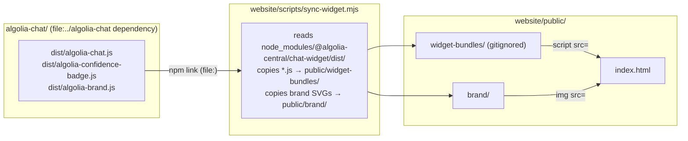

# algolia-central-website

A static demo site that hosts the compiled `<algolia-chat>` widget as a consumer would. Uses a deliberately mismatching serif font and cream background to verify the widget's Shadow DOM style isolation.

---

## Quickstart

```bash
# 1. Build the widget first (only needed once, or after widget source changes)
cd ../algolia-chat && npm run build

# 2. Install website dependencies and start the dev server
cd ../website
npm install          # resolves @algolia-central/chat-widget via file:../algolia-chat
npm run dev          # syncs bundles then starts Vite at http://localhost:5174
```

Or build the static site for deployment:

```bash
npm run build        # → website/dist/
npm run preview      # preview at http://localhost:4173
```

---

## How the website consumes the widget

The website does **not** import the widget as JavaScript modules at build time. Instead, it loads the pre-compiled IIFE bundles via plain `<script>` tags — exactly as any external site would embed the widget.



### Step-by-step

1. `package.json` declares `"@algolia-central/chat-widget": "file:../algolia-chat"`.
2. `npm install` resolves that to a symlink in `node_modules/`.
3. `npm run sync:widget` (runs automatically before `dev` and `build`) copies the widget's compiled bundles from `node_modules/@algolia-central/chat-widget/dist/` into `public/widget-bundles/`.
4. `index.html` loads the bundles in order: confidence badge **before** the main chat bundle.

---

## Directory layout

```
website/
├── package.json             # npm manifest — scripts: dev, build, preview, sync:widget
├── vite.config.ts           # Vite config: root=public, outDir=../dist, port=5174
├── scripts/
│   └── sync-widget.mjs      # Copies compiled bundles from algolia-chat/dist/ → public/widget-bundles/
└── public/                  # Vite root (everything here is served as-is)
    ├── index.html           # Demo page with full <algolia-chat> embedding example
    ├── brand/               # Brand SVGs (synced from algolia-chat/public/brand/)
    │   ├── adobe-logo.svg
    │   └── algolia-mark.svg
    └── widget-bundles/      # Compiled JS bundles (gitignored — populated by sync-widget.mjs)
        ├── algolia-chat.js
        ├── algolia-confidence-badge.js
        └── algolia-brand.js
```

---

## npm scripts

| Script | What it does |
| --- | --- |
| `npm run sync:widget` | Copy widget bundles from `algolia-chat/dist/` → `public/widget-bundles/` and brand SVGs |
| `npm run dev` | Runs `sync:widget` then starts the Vite dev server at `http://localhost:5174` |
| `npm run build` | Runs `sync:widget` then builds the static site to `dist/` |
| `npm run preview` | Serves the built `dist/` for local preview |

---

## Troubleshooting

### Widget bundles not found (`public/widget-bundles/` is empty)

`widget-bundles/` is git-ignored and only populated at dev/build time. If missing:

1. Build the widget: `cd ../algolia-chat && npm run build`
2. Sync manually: `npm run sync:widget`

The sync script logs each copied file and warns when no bundles are found.

### Widget does not appear on the page

1. Open the browser console — `[algolia-chat]` logs are the first place to look.
2. Check that `algolia-confidence-badge.js` loads **before** `algolia-chat.js` (script tag order in `index.html` matters).
3. Verify the `app-id`, `search-api-key`, and `index-name` attributes on `<algolia-chat>` are correct.
4. Ensure at least one `<algolia-agent role="primary">` child element is present.
5. If using `<algolia-chat-confidence>` or `<algolia-chat-person>` with `<algolia-agent>` children, make sure the container is a direct child of `<algolia-chat>` — child events bubble through it to the sub-orchestrator.

### Stale widget after source changes

The website dev server does **not** watch `algolia-chat/src/`. Use the two-terminal workflow from the root:

```bash
# Terminal 1
node watch.mjs        # rebuilds widget on source changes and syncs bundles

# Terminal 2
cd website && npm run dev
```

Then manually reload the browser after each widget rebuild.

### Port 5174 already in use

Kill the process using port 5174, or pass a different port:

```bash
npx vite --port 5175
```

### The widget font looks wrong

The demo page intentionally uses a serif font (`Georgia`) and cream background. The widget itself uses Sora (loaded from Google Fonts into `document.head`). If the widget font is wrong, check:

1. Google Fonts is accessible (CSP allows `fonts.googleapis.com` + `fonts.gstatic.com`).
2. The `accent-color` attribute is set — without it the widget uses neutral gray token defaults.
